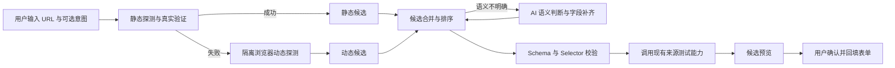

# AI 辅助配置网页采集源方案

## 1. 背景与目标

当前“更多采集器”要求用户先选择静态网页或动态网页采集，再填写底层配置字段。普通用户既难以判断页面是否依赖 JavaScript 渲染，也难以填写 `itemSelector`、`titleSelector`、`waitForSelector` 等 DOM/CSS 配置。

本方案将两个面向用户的入口合并为“网页自动采集”。用户原则上只需提供目标网址和可选采集意图；系统依次执行静态探测、动态探测、候选生成和真实试采集，自动选择底层采集器。AI 只处理候选语义排序、字段补齐和复杂交互建议，不负责凭感觉判断静态或动态。

首期目标限定为新闻、博客、公告、榜单等“重复条目列表页”。首期不解决验证码、复杂登录流程、任意脚本执行、多步骤业务流程和跨页面详情抓取。

## 2. 产品原则

1. AI 是配置助手，不直接创建或启用订阅源。
2. AI 只能填写采集器 Schema 已声明的字段，不能生成或执行 JavaScript。
3. AI 输出不能作为成功依据；必须经过 Schema 校验、Selector 校验和真实试采集。
4. 页面原文应先由确定性代码裁剪为结构摘要，再交给模型，降低成本并减少页面提示注入风险。
5. 用户应看到采集结果，而不只是看到 Selector。默认展示匹配数和 3～5 条预览。
6. 静态或动态属于可验证的执行事实，不要求用户选择，也不以 AI 猜测为依据。
7. 静态真实试采集成功时优先使用静态采集；静态失败而浏览器渲染成功时自动选择动态采集。
8. 底层静态、动态采集器仍在“高级模式”中保留，供专业用户诊断和手工覆盖自动结果。

## 3. 建议交互

### 3.1 基本流程

1. 用户选择“网页自动采集”。
2. 用户填写页面地址，可选填写采集意图，例如“主新闻列表”。
3. 点击“识别采集规则”。
4. 页面展示分析状态：静态探测、浏览器探测（如需要）、识别列表、验证规则。
5. 返回一个或多个候选，例如“主新闻列表”“热门推荐”。
6. 每个候选展示：规则说明、置信度、匹配条数、前 3～5 条标题与链接、警告。
7. 用户选择候选后点击“应用规则”；系统同时确定底层静态或动态采集器。
8. 默认只展示结果摘要；底层采集器和 Selector 收入“高级配置”，用户仍可修改并重新测试。
9. 只有成功测试过当前表单配置，才建议保存；首期可先做提示，不强制阻断保存。

### 3.2 自动选择规则

- 静态 HTML 能生成候选且真实试采集通过：选择 `declarative-web-page`；
- 静态 HTML 无候选或候选验证失败：自动启动隔离浏览器；
- 浏览器渲染后生成候选且真实试采集通过：选择 `browser-web-page`；
- 两种方式都成功：默认静态，动态候选可作为备选；
- 两种方式都失败或候选语义不明确：调用 AI 分析脱敏结构摘要，或向用户返回可执行的失败原因；
- 用户不需要理解或确认“静态/动态”，但结果区应说明系统选择和依据。

### 3.3 动态网页补充流程

动态页面分析应使用该来源的隔离 Profile。遇到登录页时返回 `AUTH_REQUIRED`，界面提示用户打开对应 Profile 完成登录后重新分析。

首期只允许推断以下动作：

- 等待一个元素出现；
- 点击一次“加载更多”或选项卡；
- 向一个输入框输入用户明确提供的固定内容；
- 动作后等待 0～5000 毫秒；
- 识别登录页元素。

AI 不应自行创造账号、密码、搜索词或其他业务输入值。

## 4. 系统流程



### 4.1 页面探测

系统始终先执行静态探测：

- 使用与 `declarative-web-page` 一致的 URL 安全检查和请求策略；
- 限制响应大小、超时、重定向次数和允许的内容类型；
- 解析服务端返回的 HTML。

静态候选不存在或真实验证失败时自动执行动态探测：

- 复用 `browser-web-page` 的隔离 Profile 和网络边界；
- 等待 `domcontentloaded`，必要时增加短暂稳定等待；
- 不执行模型生成的脚本；
- 获取经过裁剪的 DOM 结构摘要，不向模型发送 Cookie、Local Storage、请求头或表单敏感值。

### 4.2 确定性候选生成

先通过代码识别高频重复结构，减少对 AI 的依赖：

- `article`、列表项、表格行和重复 class 组合；
- 每个容器内是否具有标题文本和可解析链接；
- 可选的摘要、作者、`time[datetime]`；
- 容器数量、文本长度分布和链接唯一率；
- 排除导航栏、页脚、相关推荐小组件等低质量区域。

每个候选生成稳定、尽量简短的 CSS Selector，并在当前 DOM 上计算匹配统计。

### 4.3 AI 判断

AI 不判断页面是否“看起来像动态页面”。只有确定性探测出现多个相近候选、无法区分主列表，或页面可能需要受控交互时才调用模型。模型输入只包含：

- 目标域名和页面标题；
- 采集器类型及允许字段；
- 裁剪后的结构树和确定性候选；
- 各候选的匹配统计与少量文本样例；
- 用户可选填写的采集意图，例如“主列表”或“只采产品更新”。

模型以 JSON 返回：

```json
{
  "candidates": [
    {
      "name": "主文章列表",
      "reason": "重复卡片均包含标题链接和发布时间",
      "confidence": 0.91,
      "config": {
        "itemSelector": "main article",
        "titleSelector": "h2",
        "linkSelector": "h2 a",
        "linkAttribute": "href",
        "summarySelector": ".summary",
        "dateSelector": "time",
        "dateAttribute": "datetime",
        "limit": 30
      }
    }
  ]
}
```

服务端只接受当前插件 Schema 中存在的字段，并重新执行全部校验。模型返回的解释不能影响执行逻辑。

### 4.4 验证与排序

每个候选依次经过：

1. 插件 Schema 校验；
2. CSS Selector 语法和长度校验；
3. 当前页面匹配检查；
4. 调用采集器执行真实试采集；
5. 数据质量评分。

建议评分信号：有效条目数、标题非空率、链接有效率、链接唯一率、站内详情链接比例、日期解析率，以及标题长度是否合理。最终置信度应由“规则评分 + AI 置信度 + 试采集质量”共同决定，不能直接采用模型自报分数。

## 5. API 设计

新增端点：

```http
POST /api/collection-sources/assist
Content-Type: application/json
```

请求示例：

```json
{
  "sourceKind": "web-auto",
  "url": "https://example.com/news",
  "intent": "识别页面主新闻列表",
  "partialConfig": {
    "limit": 30
  },
  "provider": "可选模型提供商"
}
```

响应示例：

```json
{
  "status": "ok",
  "selectedPluginId": "browser-web-page",
  "selectionReason": "服务端 HTML 不包含内容列表，浏览器渲染后识别并验证了 24 条新闻",
  "page": {
    "title": "Example News",
    "mode": "dynamic",
    "renderingHint": "client-rendered"
  },
  "candidates": [
    {
      "id": "candidate-1",
      "name": "主新闻列表",
      "confidence": 0.89,
      "reason": "检测到 24 个结构一致的文章条目",
      "config": {},
      "validation": {
        "passed": true,
        "matched": 24,
        "itemCount": 24,
        "warnings": []
      },
      "preview": [
        { "title": "...", "url": "https://example.com/..." }
      ]
    }
  ],
  "warnings": []
}
```

建议错误码：

- `AUTH_REQUIRED`：需要在隔离 Profile 登录；
- `DYNAMIC_RENDER_FAILED`：静态探测失败后，浏览器渲染也未得到有效页面；
- `NO_REPEAT_STRUCTURE`：未识别到可靠列表；
- `BOT_CHALLENGE`：验证码或安全挑战；
- `UNSUPPORTED_INTERACTION`：需要多步骤或复杂交互；
- `SELECTOR_MISMATCH`：候选验证失败；
- `MODEL_UNAVAILABLE`：模型未配置或调用失败；
- `PAGE_TOO_LARGE`、`TIMEOUT`、`NETWORK_ERROR`。

首期无需持久化 AI 候选。响应回到浏览器后，用户选择候选；前端按 `selectedPluginId` 写入底层来源配置，最终仍通过现有 `/api/collection-sources/test` 和 `/api/collection-sources` 完成测试与保存。

## 6. 代码结构建议

新增：

- `server/platform/collectors/source-assistant-service.mjs`：编排探测、AI、验证和候选排序；
- `server/platform/collectors/page-structure-analyzer.mjs`：DOM 裁剪、重复结构分析和规则候选；
- `server/platform/llm/source-configuration-assistant.mjs`：模型提示词、JSON 解析和字段白名单；
- `server/platform/http/routes/source-assistant-routes.mjs`，或将端点接入现有来源路由；
- 对应单元测试与路由测试。

复用：

- 两个网页采集器现有 URL 安全检查和执行能力；
- Collector Manifest 的 `sourceConfigSchema`；
- `/api/collection-sources/test` 的测试逻辑；
- `ModelGateway.complete(..., { json: true })` 一类现有 JSON 输出能力；
- 当前订阅源表单的 Schema 字段渲染和回填逻辑。

前端在 `public/src/views/subscriptions.js` 增加或调整：

- 面向普通用户只展示“网页自动采集”；
- 静态和动态底层采集器移入“高级模式”；
- URL 未填写时禁用按钮；
- 分析进度、候选卡片和预览结果；
- “应用到表单”操作；
- 展示自动选择的执行方式及判断依据，不要求用户手动切换；
- 应用候选后将当前测试状态重置为“尚未测试”。

## 7. 安全与隐私边界

1. 必须复用现有 SSRF 防护，仅允许 HTTP/HTTPS 公网页面，阻止环回、内网、云元数据和重定向绕过。
2. 发给模型的 DOM 结构必须限长、去脚本、去样式、去隐藏字段、去输入值和疑似密钥。
3. 页面中的文字一律视为不可信数据。系统提示必须明确忽略页面内的指令，模型输出也只能进入严格 JSON 白名单。
4. 动态探测不得导出 Cookie、Local Storage 或认证请求头。
5. Selector 执行前限制长度、数量和复杂度，防止极端 Selector 导致 CPU 消耗。
6. 单次辅助分析限制候选数、模型调用次数、页面大小和总耗时。
7. 记录模型调用和验证结果用于审计，但不记录登录凭据及完整私有页面 DOM。

## 8. 分阶段实施

### Phase 0：无 AI 的可用性改善（已完成）

工作量最小，建议首先完成：

- 给每个字段增加通俗说明、示例和“高级字段”折叠；
- 默认只显示 URL、条目选择器、标题和链接；
- 测试结果展示具体预览，而非只有“成功/条数”；
- 为底层静态与动态采集器提供说明，作为统一入口完成前的过渡和高级诊断能力。

价值：即使 AI 服务未配置，表单也会明显更易用，并为后续候选预览复用 UI。

### Phase 1：静态优先、动态降级的自动识别内核（已完成）

- 静态 HTML 确定性分析生成候选；
- 静态无候选时自动使用隔离浏览器渲染；
- 自动生成静态或动态底层配置；
- 对候选执行真实提取验证；
- 返回最多 3 个候选并展示预览；
- 用户确认后回填底层配置，不自动保存；
- AI 排序与补齐暂未接入。

工信部动态栏目页已作为真实验证样本：静态 HTML 无内容列表，隔离浏览器渲染后可识别并验证 24 条新闻。

### Phase 2：统一“网页自动采集”产品入口（已完成）

- 在“更多采集器”中新增唯一的普通用户入口“网页自动采集”；
- 用户只填写 URL 和可选采集意图，不再选择静态或动态；
- 自动执行静态优先、动态降级，并直接展示系统选择与依据；
- 应用候选时自动写入对应底层 `pluginId`；
- 静态、动态采集器移入高级模式，不在普通选择列表中并列展示；
- 测试和保存继续使用现有底层采集器契约。

### Phase 3：AI 语义排序与受控交互

- 多组列表候选接近时，结合用户意图判断主列表、侧栏或推荐区（AI 安全重排已完成）；
- 补齐摘要、作者、日期等可选字段（白名单选择与二次真实验证已完成）；
- 支持等待元素和一次点击；
- 登录态诊断与重新分析；
- 模型输出必须通过字段白名单、Schema 和真实试采集。

### Phase 4：交互式纠错

- 用户指出“标题不对”“这是侧栏”等反馈；
- 基于上一次页面快照重排候选，避免重复抓取；
- 保存站点级成功模板；
- 页面结构变化后提供规则修复建议。

## 9. 测试计划

单元测试：

- 重复容器识别和候选排序；
- 相对链接转绝对链接；
- 字段白名单和 Schema 校验；
- 恶意或越界 AI JSON 被拒绝；
- DOM 脱敏、裁剪和页面提示注入文本隔离；
- 质量评分。

集成测试：

- 服务端渲染新闻列表；
- 多个列表区域的候选区分；
- 空页面、详情页、无重复结构页面；
- 静态请求拿到壳页面时自动进入动态探测；
- 静态和动态均成功时优先选择静态；
- 动态成功时响应包含 `selectedPluginId=browser-web-page` 和可核验依据；
- 动态登录页返回 `AUTH_REQUIRED`；
- 模型不可用时返回确定性候选或明确降级结果；
- AI 候选真实测试失败时不标记为可用。

前端测试：

- 普通模式只展示统一“网页自动采集”入口；
- 高级模式仍可选择底层静态或动态采集器；
- URL 为空不能分析；
- 候选切换、预览和表单回填；
- 回填后测试状态失效；
- 错误码转为可执行的人类提示。

## 10. MVP 验收标准

1. 对测试集中的常规新闻、博客和政府公告列表页，至少 80% 能返回一个通过真实试采集的静态或动态候选。
2. 成功候选的标题、链接有效率均不低于 90%。
3. AI 不可用时，确定性分析仍能返回候选或明确说明无法识别。
4. 任何 AI 输出都不能绕过插件 Schema 或引入 JavaScript。
5. 用户无需判断静态/动态，也无需填写 CSS Selector，即可完成“URL → 自动选择 → 候选预览 → 测试 → 保存”。
6. 助手不会自动保存、启用或覆盖已有来源配置。

## 11. 风险与决策点

实施前需要确认：

- 是否首期要求配置必须测试成功才能保存；建议首期只强提示，稳定后再设硬门禁。
- 是否允许向已配置的第三方模型发送脱敏后的页面结构；建议界面明确提示，并沿用现有模型提供商。
- 动态页面首期是否支持输入动作；建议 AI 交互阶段先只支持等待与点击，输入动作延后。
- 是否保存页面结构快照用于纠错；建议 MVP 不落盘，只保留请求生命周期内的精简摘要。

## 12. 推荐实施顺序

建议按以下顺序推进：

1. 已完成 Phase 0：字段说明、基础/高级分组、测试结果预览；
2. 已完成自动识别内核：静态优先、动态降级、候选验证和一键回填；
3. 已完成统一产品入口，普通用户只需选择“网页自动采集”，底层实现保留在高级手动配置；
4. 下一步用更多真实站点评估候选质量、误选率和耗时；
5. AI 语义排序与经过二次真实验证的摘要、作者、日期字段补齐已完成；后续可按实际站点需求评估一次受控点击；
6. 最后增加交互式纠错和站点级成功模板。

这个顺序把渲染方式判断留给可验证的程序探测，把“哪个列表符合用户意图”等语义问题留给 AI。用户不再承担技术选型，模型也不会替代真实采集验证。
