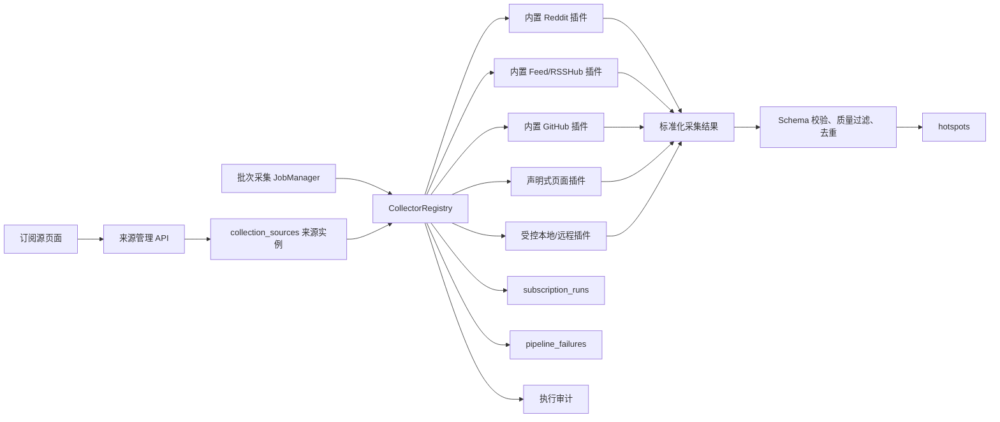

# 动态扩展配置、采集插件化与自定义页面源设计方案

> 类别：未来计划
> 状态：待评审，尚未实施
> 日期：2026-08-11
> 目标：先为技能、工具和采集插件建立动态配置与凭据基础设施，再将 Reddit、RSSHub、GitHub 等内置采集逻辑统一到可扩展协议，并逐步支持用户配置公开网页采集源；不在第一版开放不受控的任意脚本执行。

## 1. 背景

当前采集能力已经覆盖三类来源：

- Reddit：`plugins/reddit/collector.mjs` 通过专用 Chrome CDP 复用登录态，按采集源配置读取 Reddit 分区，页面选择器写在 Collector 插件实现中。
- RSSHub 与直连 Feed：`plugins/rsshub/collector.mjs` 读取统一采集源与 Collector 配置。
- GitHub：Trending 通过 RSSHub，增长发现和兴趣查询通过 GitHub API 与现有发现逻辑完成。

批次采集由 `lib/jobs/job-manager.mjs` 直接导入并调用具体采集器。订阅源页面目前只管理 RSSHub、X、直连 Feed 和只读 GitHub 入口，Reddit 分区尚未纳入统一管理。

这种实现对少量固定来源很直接，但每新增一种采集方式，通常需要同时修改：

- 采集任务编排；
- 配置结构和持久化；
- 订阅源 CRUD 与测试接口；
- 前端来源类型与表单；
- 健康状态、执行日志和错误映射；
- 单源重试与跳过逻辑；
- 测试、API 文档和配置文档。

项目已经具备工具插件注册、Manifest 校验、权限策略、远程访问保护、执行审计和插件安装管理，但工具插件面向“一次输入、一次输出”。采集任务则具有以下不同特点：

- 一次批次会并行或串行执行多个来源实例；
- 一个插件可以管理多个订阅源；
- 采集过程中需要逐源报告状态，而不是结束后只返回一个结果；
- 失败恢复以具体来源实例为单位；
- 部分来源依赖浏览器会话、分页或限速；
- 采集结果必须经过统一规范化、去重和质量过滤后才能入库。

因此，本方案复用现有插件基础设施，但为采集建立独立的注册、实例和运行协议。

## 2. 设计目标

### 2.1 必须实现

1. 技能、工具和采集插件可以通过 Manifest 声明动态配置、凭据和作用域，新增字段无需修改核心页面。
2. 内置 Reddit、RSSHub、直连 Feed 和 GitHub 通过统一采集协议执行。
3. 订阅源页面能够管理 Reddit 分区，不再依赖手工编辑配置文件。
4. 新增采集插件时，无需修改批次任务编排和失败恢复主流程。
5. 每个来源实例都有稳定的 `sourceKey`，可独立测试、启停、重试、跳过和查看健康历史。
6. 支持声明式公开网页采集源，用户通过 URL 和 CSS 选择器配置，不必编写代码。
7. 采集插件输出必须经过 Schema 校验、统一清洗和安全边界检查。
8. 复用 `pipeline_failures`、订阅运行记录和工具执行审计。
9. 旧配置可以幂等迁移，升级后原有采集行为不变。

### 2.2 暂不实现

- 不允许普通用户在界面直接粘贴并执行任意 JavaScript。
- 不承诺自动绕过验证码、Cloudflare、人机验证或强反爬。
- 不在第一阶段实现定时创建批次和无人值守调度。
- 不支持插件直接写入热点、候选、文章或其他业务表。
- 不让插件决定打标、聚类、研判或写作逻辑。
- 不把浏览器登录凭据写进来源配置或执行日志。

## 3. 总体架构



核心分层：

1. `CollectorRegistry`：发现插件、校验能力、创建执行器，不保存业务数据。
2. `collection_sources`：保存用户实际配置的来源实例，例如 `r/programming` 或某个列表页。
3. `CollectionRunner`：读取启用来源，控制并发、超时、进度和取消，调用插件。
4. 采集插件：只负责访问目标和返回标准数据。
5. 归一化层：统一处理时间、URL、来源身份、空内容和重复项。
6. 持久化层：由核心系统写热点、运行记录和失败记录，插件无数据库写权限。

## 4. 为什么不直接复用 ToolRegistry

现有 `ToolRegistry.resolve(capability)` 会从多个实现中选择一个优先实现，适合“网页正文读取”这类能力槽位。采集任务则需要同时执行多个不同插件及其多个实例，例如：

- Reddit 插件执行 8 个 subreddit；
- Feed 插件执行 20 条 RSSHub route 和 7 个直连 Feed；
- GitHub 插件执行 Trending、增长搜索和兴趣查询；
- 页面插件执行 5 个用户配置的网站。

因此不能把所有来源都注册成 `content.feed.collect` 后只解析出一个优先插件。

建议新增 `CollectorRegistry`，但复用下列现有组件：

- Manifest 基础字段、版本兼容判断和安装包限制；
- `permissions`、`riskLevel` 和首次执行确认；
- 网络域名、内网地址、跳转和响应体大小保护；
- 输入、输出 Schema 校验；
- 执行日志格式和敏感字段脱敏；
- 插件启停、版本和来源可信度管理。

`ToolRegistry` 与 `CollectorRegistry` 共享底层 Manifest/Policy/Package 工具，但拥有不同的解析和调度语义。

## 5. 动态扩展配置基础设施（前置）

采集插件化之前必须先解决技能和工具插件的动态配置问题。当前实现存在三个固定边界：

- `data/tool-plugin-settings.json` 只接受 `enabled` 和 `priority`；
- 远程工具插件只支持一个 `credentialProfile + token`；
- 技能 `skill.json` 没有配置 Schema，系统设置页和技能页表单字段由核心前端写死。

如果不先调整这一层，任何需要新增 Endpoint、账号、选择器、模型参数、目录、超时或多个凭据的技能/插件，都仍需修改核心后端和页面，采集插件化只能解决执行接口，不能真正降低扩展成本。

### 5.1 统一配置声明

技能、工具插件和采集插件统一支持以下可选 Manifest 字段：

```json
{
  "configuration": {
    "schemaVersion": 1,
    "scope": ["global", "entry-point"],
    "schema": {
      "type": "object",
      "additionalProperties": false,
      "properties": {
        "endpoint": {
          "type": "string",
          "format": "uri",
          "title": "服务地址",
          "description": "只允许 HTTPS"
        },
        "timeoutMs": {
          "type": "integer",
          "minimum": 1000,
          "maximum": 30000,
          "default": 10000,
          "title": "超时时间"
        },
        "mode": {
          "type": "string",
          "enum": ["fast", "balanced", "quality"],
          "default": "balanced",
          "title": "执行模式"
        }
      }
    },
    "uiSchema": {
      "order": ["endpoint", "timeoutMs", "mode"],
      "groups": [
        { "id": "connection", "title": "连接", "fields": ["endpoint", "timeoutMs"] }
      ]
    }
  },
  "credentials": {
    "profile": "example-service",
    "schema": {
      "type": "object",
      "additionalProperties": false,
      "properties": {
        "apiKey": { "type": "string", "title": "API Key", "secret": true },
        "account": { "type": "string", "title": "账号", "secret": false }
      },
      "required": ["apiKey"]
    }
  }
}
```

职责分离：

- `configuration.schema`：非敏感、可回读、可备份的运行配置。
- `credentials.schema`：敏感或身份字段，秘密值不通过读取接口返回。
- `uiSchema`：只描述顺序、分组和控件提示，不允许携带 HTML 或脚本。
- 采集插件的 `sourceConfigSchema`：每个来源实例的业务配置，例如 subreddit 或 CSS 选择器；它不替代插件自身的全局配置。

例如声明式网页插件可以具有三层数据：

- 插件全局配置：默认超时、默认 User-Agent、域名并发数；
- 凭据配置：可选代理服务 Token；
- 来源实例配置：具体页面 URL 和选择器。

### 5.2 第一版支持的 Schema 子集

动态表单只支持可安全确定性渲染的 JSON Schema 子集：

- `string`、`integer`、`number`、`boolean`；
- `enum`；
- 一层对象分组；
- 字符串数组；
- `default`、`title`、`description`；
- `minimum`、`maximum`、`minLength`、`maxLength`、`pattern`；
- `format: uri | hostname | path`；
- `required` 和 `additionalProperties: false`。

第一版不支持：

- 插件提供自定义 HTML、CSS 或 JavaScript 控件；
- 任意深度递归对象；
- `oneOf`/`anyOf` 的复杂联合表单；
- Schema 内远程引用；
- 表达式、模板或动态代码校验。

条件字段使用受限的 `uiSchema.visibleWhen`，只允许同一配置对象内的“字段等于枚举值”，由核心解释执行。

### 5.3 配置作用域

统一支持四种作用域，但每个扩展必须在 Manifest 中声明自己允许的范围：

| 作用域 | 用途 | 示例 |
|---|---|---|
| `global` | 插件或技能的全局默认配置 | 默认超时、默认模式 |
| `entry-point` | 技能在不同流水线入口的配置 | 文章审稿严格度、早报审稿严格度 |
| `source` | 单个采集来源实例配置 | `r/programming`、页面选择器 |
| `invocation` | 单次任务临时覆盖，不持久化 | 本次最大条数、强制刷新 |

解析优先级固定为：

```text
Manifest default
  < global
  < entry-point / source
  < invocation
```

调用前由核心合并、校验并冻结配置，扩展只收到最终值。扩展不能自行读取其他扩展配置或 `config.local.json`。

技能配置通过运行时上下文传入，并记录在 generation snapshot 中，保证历史任务可复现。不得简单拼接未经转义的配置到系统 Prompt；结构化参数由对应技能运行器显式消费。

### 5.4 非敏感配置存储

建议新增统一表，而不是继续为每类扩展增加 JSON 文件：

```sql
CREATE TABLE extension_settings (
  id INTEGER PRIMARY KEY AUTOINCREMENT,
  extension_type TEXT NOT NULL,
  extension_id TEXT NOT NULL,
  scope_type TEXT NOT NULL,
  scope_key TEXT NOT NULL DEFAULT '',
  manifest_version TEXT NOT NULL,
  schema_version INTEGER NOT NULL,
  values_json TEXT NOT NULL,
  status TEXT NOT NULL DEFAULT 'ready',
  validation_error TEXT,
  created_at TEXT NOT NULL,
  updated_at TEXT NOT NULL,
  UNIQUE(extension_type, extension_id, scope_type, scope_key)
);
```

其中：

- `extension_type`：`skill | tool | collector`；
- `scope_key`：全局为空，入口为 entry point ID，来源为来源实例 ID；
- `values_json`：只保存通过当前 Manifest Schema 校验的非敏感字段；
- `status`：`ready | needs_configuration | incompatible`；
- Manifest 默认值不重复写入数据库，避免升级时旧默认值永久覆盖新版本。

启用、优先级仍属于扩展生命周期状态，可以保留现有文件或一并迁移，但不能混进业务配置 Schema。

### 5.5 凭据模型

现有单 Token 凭据存储需要扩展为多字段 Profile：

```text
profile: example-service
fields: apiKey, clientId, clientSecret
```

要求：

- 密钥值不写 SQLite、不进入普通备份、不出现在执行日志。
- GET 接口只返回字段级状态：是否配置、更新时间和掩码提示，不返回原值。
- 更新时支持逐字段保留、替换和清除，不能用空字符串误删其他字段。
- 插件只能收到 Manifest 声明且任务授权的凭据字段。
- 插件卸载默认清除凭据；如选择保留，必须显示明确提示。
- 本机第一阶段可以泛化现有 `.env.remote-plugins` 存储；后续优先接 Windows Credential Manager、macOS Keychain 和 Linux Secret Service。
- `path`、用户名、公开 Endpoint 等非秘密字段不应伪装成 Secret，否则会失去可审计性和配置导出能力。

### 5.6 动态设置页面

技能与插件页增加统一的“配置”入口：

1. 前端读取 Manifest 中经过服务端过滤的配置描述。
2. 核心动态表单渲染器只渲染白名单控件。
3. 加载已保存的非敏感配置和凭据配置状态。
4. 保存前先在前端做体验性校验，后端再次做权威 Schema 校验。
5. 支持“恢复默认值”“测试配置”和“查看影响范围”。
6. 配置保存成功后按 Manifest 声明决定即时生效或提示重启。

系统设置页继续保留工作台自身固定配置，例如端口、工作区和运行时服务路径；扩展自己的字段不再进入系统固定表单。

采集来源表单可以复用同一渲染器，但 `sourceConfigSchema` 的保存目标是 `collection_sources.config_json`，不是 `extension_settings`。

### 5.7 API 草案

```text
GET    /api/system/extensions/:type/:id/config-schema
GET    /api/system/extensions/:type/:id/settings?scopeType=&scopeKey=
PUT    /api/system/extensions/:type/:id/settings
DELETE /api/system/extensions/:type/:id/settings?scopeType=&scopeKey=
GET    /api/system/extensions/:type/:id/credentials
PUT    /api/system/extensions/:type/:id/credentials
DELETE /api/system/extensions/:type/:id/credentials/:field
POST   /api/system/extensions/:type/:id/test-configuration
```

保存接口必须从服务端已安装 Manifest 读取 Schema，不能接受前端自行提交 Schema。技能和本地插件配置变更继续使用管理员确认头；普通来源实例配置由来源管理权限控制。

### 5.8 插件升级与配置兼容

插件升级后执行以下检查：

1. 用新 Schema 重新验证已保存配置。
2. 仍兼容则保留，并更新 `manifest_version`。
3. 不兼容则标记 `needs_configuration`，插件或关联来源暂停执行。
4. 页面显示失效字段和重新配置入口。
5. 不静默删除未知字段，不用默认值掩盖必填项缺失。

第一版要求配置 Schema 只做向后兼容演进。后续如果允许插件提供迁移器，迁移必须在受控本地插件进程中运行，展示变更摘要并保留回滚快照；远程 Manifest 不允许提供本地迁移代码。

### 5.9 与现有机制的迁移

- `tool-plugin-settings.json` 中的 `enabled/priority` 保留为生命周期设置，新增业务配置迁入 `extension_settings`。
- `credentialProfile + token` 自动映射为凭据 Schema 中的 `token` 字段。
- 技能原有覆盖层继续负责 Prompt/文档覆盖，结构化运行参数迁入动态配置层。
- `information-capability-slots.json` 仍负责“能力选择哪个插件”，不承担插件参数。
- 工作台自身 `.env`、模型服务商和 RSSHub 运行进程设置暂不迁移，避免把核心运行配置与扩展配置混为一谈。

### 5.10 动态配置验收条件

- [ ] 新插件增加普通配置字段时不需要修改核心前端代码。
- [ ] 新技能声明入口级参数后能在技能页动态配置。
- [ ] 新采集插件的全局配置和来源实例配置相互独立。
- [ ] 多字段凭据可分别配置、保留和清除，读取接口不返回秘密值。
- [ ] 非法字段、未知字段和越界数值被后端拒绝。
- [ ] 插件不能提交自定义 HTML 或脚本到配置页面。
- [ ] 配置解析顺序稳定，并被任务快照与执行审计记录。
- [ ] 插件升级导致配置不兼容时停止执行并提示重新配置。
- [ ] 卸载、停用插件时展示受影响的技能入口和采集来源。

## 6. 采集插件协议

### 6.1 Manifest

建议在现有 Manifest 基础上增加 `kind: "collector"`，示例：

```json
{
  "schemaVersion": 1,
  "id": "reddit-collector",
  "name": "Reddit 热门分区",
  "version": "1.0.0",
  "kind": "collector",
  "type": "local-adapter",
  "entry": "./adapter.mjs",
  "compatibleApp": ">=0.6.0",
  "sourceTypes": ["reddit"],
  "riskLevel": "browser-read",
  "permissions": {
    "networkDomains": ["old.reddit.com"],
    "browserProfiles": ["reddit"],
    "pathAccess": [],
    "externalWrite": false,
    "credentials": []
  },
  "sourceConfigSchema": {
    "type": "object",
    "required": ["subreddit"],
    "properties": {
      "subreddit": { "type": "string", "pattern": "^[A-Za-z0-9_]{2,21}$" },
      "sort": { "enum": ["hot", "new", "top"] },
      "limit": { "type": "integer", "minimum": 1, "maximum": 50 }
    }
  },
  "timeoutMs": 60000
}
```

`sourceConfigSchema` 同时用于：

- 后端输入校验；
- 订阅源动态表单；
- 插件升级兼容性检查；
- 配置导入导出时的门禁。

第一版前端不必实现完整 JSON Schema 表单引擎。内置类型可以使用明确表单，第三方插件暂用受限字段集合：字符串、URL、整数、布尔和枚举。

### 6.2 Adapter 接口

```js
export default {
  async health(context) {},
  async validateSource(sourceConfig, context) {},
  async test(sourceConfig, context) {},
  async collect(sourceConfig, context) {}
};
```

语义：

- `health`：检查插件依赖，例如 Chrome CDP、RSSHub 服务或 API 凭据。
- `validateSource`：纯校验和规范化，不访问网络。
- `test`：执行小规模真实请求，最多返回 5 条预览。
- `collect`：执行正式采集，返回标准结果。

插件不提供单独的 `retry` 方法。重试仍调用 `collect`，只是核心层只传入失败的来源实例，并在 `context.retry` 中提供失败 ID、次数和上次错误。这能避免正常采集和重试产生两套实现。

### 6.3 执行上下文

```js
{
  batchId,
  sourceId,
  sourceKey,
  retry: { active, failureId, retryCount },
  limits: { maxItems, timeoutMs, maxResponseBytes },
  signal,
  browser,
  fetch,
  log(message, metadata),
  emitProgress(progress)
}
```

约束：

- `fetch` 必须是核心提供的安全请求封装，不直接把全局 `fetch` 暴露给声明式插件。
- `browser` 只在 Manifest 获得相应权限时提供，并绑定指定 Profile。
- `signal` 用于超时、用户取消和服务退出。
- 日志只允许结构化元数据，不记录 Cookie、Authorization、完整页面正文或环境变量。

### 6.4 标准输出

```js
{
  status: "ok",
  items: [
    {
      "externalId": "t3_xxx",
      "title": "Example title",
      "url": "https://example.com/article",
      "discussionUrl": "https://old.reddit.com/...",
      "summary": "Optional summary",
      "author": "optional",
      "publishedAt": "2026-08-11T08:00:00.000Z",
      "metrics": { "score": 120 },
      "raw": {}
    }
  ],
  warnings: [],
  provenance: {
    "pageUrl": "https://old.reddit.com/r/programming/hot/",
    "fetchMethod": "browser-cdp"
  }
}
```

核心层补充并持久化：

- `sourceGroup`、`sourceType`、`sourceKey`、`sourceName`；
- 插件 ID 与版本；
- 批次、来源实例和运行 ID；
- 开始/结束时间、耗时和条目数；
- 质量过滤和去重结果。

插件不得覆盖核心生成的身份字段。

### 6.5 错误契约

统一错误码建议：

| 错误码 | 是否可重试 | 示例 |
|---|---:|---|
| `INVALID_SOURCE_CONFIG` | 否 | subreddit 或选择器非法 |
| `DEPENDENCY_MISSING` | 否 | Chrome/CDP 未启动 |
| `AUTH_REQUIRED` | 条件式 | Reddit 登录失效 |
| `RATE_LIMITED` | 是 | HTTP 429 |
| `TIMEOUT` | 是 | 页面加载超时 |
| `BLOCKED` | 条件式 | 验证码或安全页 |
| `SELECTOR_MISMATCH` | 否 | 页面改版后没有匹配项 |
| `OUTPUT_INVALID` | 否 | 插件返回数据不符合 Schema |
| `NETWORK_ERROR` | 是 | DNS、连接和 5xx |
| `CANCELLED` | 否 | 用户取消或服务退出 |

错误对象：

```js
{
  status: "error",
  error: {
    code: "SELECTOR_MISMATCH",
    message: "条目选择器没有匹配到内容",
    retryable: false,
    action: "重新测试并更新页面选择器"
  }
}
```

## 7. 来源实例模型

建议新增 SQLite 表 `collection_sources`，逐步替代分散在 `config.local.json` 中的业务来源配置。

```sql
CREATE TABLE collection_sources (
  id INTEGER PRIMARY KEY AUTOINCREMENT,
  plugin_id TEXT NOT NULL,
  plugin_version TEXT,
  source_type TEXT NOT NULL,
  source_key TEXT NOT NULL UNIQUE,
  label TEXT NOT NULL,
  config_json TEXT NOT NULL,
  enabled INTEGER NOT NULL DEFAULT 1,
  managed INTEGER NOT NULL DEFAULT 0,
  created_at TEXT NOT NULL,
  updated_at TEXT NOT NULL,
  last_tested_at TEXT,
  last_test_status TEXT,
  last_test_error TEXT
);
```

设计原则：

- `source_key` 是逻辑身份，不包含插件版本和可变参数。
- `plugin_version` 记录最近一次成功验证配置时的版本，插件升级后可提示重新测试。
- `config_json` 不允许保存密码、Cookie 或 API Key，只保存非敏感配置。
- 凭据继续使用现有 credential profile 机制。
- `managed=1` 表示系统派生入口，例如 GitHub Search，只展示健康状态，不允许删除。

稳定 Key 示例：

| 来源 | `source_key` |
|---|---|
| Reddit | `reddit:r/programming` |
| RSSHub | `rsshub:/readhub/daily` |
| X | `twitter:/twitter/user/OpenAI` |
| 直连 Feed | `direct:https://example.com/feed.xml` |
| GitHub Trending | `github:trending:daily` |
| 声明式网页 | `web-page:{sourceId}` |

声明式网页不能只用 URL 作为 Key，因为同一页面可能配置多个栏目或多套选择器；使用数据库 ID 可以保证身份稳定。

## 8. Reddit 插件化方案

### 8.1 用户体验

订阅源页面新增“Reddit 分区”类型，接受：

- `programming`
- `r/programming`
- `https://www.reddit.com/r/programming/`

保存时统一为：

```json
{
  "subreddit": "programming",
  "sort": "hot",
  "limit": 15
}
```

列表支持：

- 测试：连接专用 Chrome，只读取当前分区前 3～5 条；
- 启用/暂停；
- 删除；
- 查看最近采集状态；
- 失败后单源重试。

批次采集只需选择来源组“Reddit”，`CollectionRunner` 会自动查询并执行所有启用的 Reddit 来源实例。

### 8.2 内部迁移

第一阶段不重写 Reddit 页面解析，只把现有逻辑拆成单实例：

```js
collectRedditSource({ subreddit, sort, limit }, context)
```

然后由 Reddit 插件负责复用同一个 CDP 连接执行多个实例。必须避免每个 subreddit 都新建 Chrome 连接，否则来源数增多后性能和稳定性会变差。

建议支持会话级生命周期：

```js
const session = await plugin.openSession(context);
try {
  for (const source of sources) await session.collect(source.config, context);
} finally {
  await session.close();
}
```

`openSession` 是可选优化，Feed 和远程 API 插件不需要实现。

## 9. 声明式页面采集

### 9.1 第一版范围

仅支持无需登录的公开静态 HTML 页面：

- 一个列表页；
- CSS 选择器定位条目；
- 从每个条目提取标题、链接、时间和摘要；
- 可选设置基础 URL；
- 可选最多翻 1～3 页，但只支持明确的“下一页”链接选择器；
- 不执行用户 JavaScript；
- 不处理点击加载、无限滚动、验证码和登录表单。

配置示例：

```json
{
  "url": "https://example.com/technology",
  "itemSelector": "article.news-item",
  "titleSelector": "h2 a",
  "linkSelector": "h2 a",
  "linkAttribute": "href",
  "summarySelector": ".summary",
  "dateSelector": "time",
  "dateAttribute": "datetime",
  "nextPageSelector": "a.next",
  "maxPages": 1,
  "maxItems": 30
}
```

### 9.2 配置流程

1. 用户选择“普通网页”。
2. 输入 URL 和显示名称。
3. 填写条目、标题、链接等选择器。
4. 点击“测试解析”。
5. 后端抓取页面并返回前 5 条预览，以及每个选择器的匹配数量。
6. 至少识别出 1 条标题和合法公开 URL 才允许保存。
7. 保存后作为普通来源参与批次采集。

测试响应应包含可操作诊断：

```json
{
  "ok": false,
  "matches": {
    "items": 12,
    "titles": 0,
    "links": 12,
    "dates": 0
  },
  "error": {
    "code": "SELECTOR_MISMATCH",
    "message": "标题选择器没有匹配到内容"
  }
}
```

### 9.3 浏览器模式

动态渲染页面不应自动回退到浏览器，以免普通配置无意间获得更高权限。后续可以增加显式模式：

- `fetchMode: static`：默认，安全 HTTP 获取；
- `fetchMode: browser`：高风险，需要首次确认和指定浏览器 Profile；
- `fetchMode: remote`：调用已安装的远程采集插件。

浏览器模式仍只允许声明式导航、等待和选择器读取，不允许用户注入任意脚本。

## 10. 受控代码插件

### 10.1 本地插件

适合固定复杂站点或内部团队维护的采集器。沿用现有本地工具插件规则：

- 安装来源必须可信；
- 包内只允许限定文件类型和大小；
- adapter 只允许 `node:` 与包内相对导入；
- 安装后默认停用；
- 启用和首次执行时展示权限；
- 版本升级重新做 Manifest 和内容哈希校验。

需要明确：Node 进程内加载不是安全沙箱。即使限制 import，受信本地代码仍可能消耗 CPU、内存或利用 Node 能力。因此第一版只面向用户明确安装的可信插件。

更强隔离可以作为后续阶段：

- 每次执行使用子进程；
- 限制环境变量白名单；
- 限制工作目录和临时目录；
- 硬超时后终止子进程；
- Windows Job Object 或等效机制限制资源；
- 通过 JSON Lines 在父子进程间传输数据。

### 10.2 远程插件

远程采集服务适合专业爬虫。项目只提交来源配置和批次限制，远程服务返回标准采集结果。

应复用现有远程插件约束：

- HTTPS；
- 固定允许域名；
- DNS 和每次跳转都拒绝本机、内网和保留地址；
- 超时和最大响应体；
- 凭据 Profile；
- 首次执行确认；
- API 或 MCP 类型；
- 响应 Schema 校验。

远程服务不能直接回调本机业务接口，也不能返回本机文件路径。

## 11. 安全边界

### 11.1 网络

- 所有用户配置 URL 必须为 HTTP(S)。
- 禁止内嵌用户名和密码。
- 静态页面、Feed 和远程插件复用现有 SSRF 防护。
- 每次重定向重新检查目标地址。
- 默认限制页面 12 MB，插件可声明更小值，不能自行放大到系统上限之外。
- 每来源设置超时、最大页数和最大条目数。
- 域名并发和请求间隔由核心统一控制。

### 11.2 浏览器

- Profile 按用途隔离，例如 Reddit 只使用 `reddit` Profile。
- 插件不能读取 Cookie 内容，只能通过受控浏览器会话访问页面。
- 浏览器权限必须在 Manifest 中声明并首次确认。
- 禁止声明式页面源导航到 `file:`、浏览器内部页、本机服务和内网地址。
- 页面返回下载、弹窗或跨域导航时默认阻止。

### 11.3 数据与日志

- 插件只返回采集结果，不获得 Store 或数据库对象。
- 原始 HTML 默认不持久化；调试快照需显式开启并设置保留期。
- `raw` 字段限制大小并做 JSON Schema 校验。
- 错误日志不得包含 Cookie、Authorization、API Key 和完整响应正文。
- 执行审计记录插件、版本、来源 ID、耗时、状态和错误码。

### 11.4 任意脚本

第一版明确拒绝在订阅源页面提供 JavaScript 编辑器。若未来开放，仅允许：

- 本地受信插件包；
- 明确权限确认；
- 子进程隔离和硬超时；
- 不继承完整环境变量；
- 无数据库和业务目录写权限；
- 完整执行审计。

即使做到上述限制，也应把它标记为“高级、受信代码”，不能宣传为安全沙箱。

## 12. 与失败恢复机制的整合

现有 `pipeline_failures` 已支持采集阶段按来源实例记录、重试和跳过。插件化后沿用以下规则：

- `stage = collect`
- `object_type = subscription`
- `object_key = source:{collectionSourceId}`
- `source_run_id` 指向顶层来源组运行；
- `subscription_run_id` 指向本次具体来源运行；
- `detail_json` 增加插件 ID、版本、错误码、是否可重试和建议操作。

示例：

```json
{
  "pluginId": "declarative-web-page",
  "pluginVersion": "1.0.0",
  "sourceKey": "web-page:42",
  "errorCode": "SELECTOR_MISMATCH",
  "retryable": false,
  "action": "重新测试并更新标题选择器"
}
```

行为：

- “重试”只执行该来源实例。
- “跳过”只影响当前批次，不永久停用来源。
- “暂停来源”修改 `collection_sources.enabled`，影响后续批次。
- 插件输出无效时记为插件失败，不允许部分脏数据入库。
- 同一批次、同一来源再次失败时更新原失败记录并保留首次失败时间。

## 13. 调度与并发

`CollectionRunner` 建议按插件和来源维度双层限流：

```text
批次总并发：4
Feed 插件：5
静态页面插件：3
GitHub API：2
浏览器会话：1
同域名：1～2
```

具体数值可配置，但要有系统硬上限。

同一插件的来源可分为：

- `parallel`：Feed、公开静态页面；
- `sequential`：共用同一浏览器标签页的 Reddit；
- `session`：插件打开一次会话后串行执行多个来源。

单个来源失败不应中断其他来源；当某来源组全部失败时，顶层 `source_run` 才标记失败。部分成功则记录为部分完成，并保留具体失败项。

## 14. API 草案

```text
GET    /api/collector-plugins
GET    /api/collection-sources
POST   /api/collection-sources/test
POST   /api/collection-sources
PATCH  /api/collection-sources/:id
DELETE /api/collection-sources/:id
POST   /api/collection-sources/:id/test
POST   /api/collection-sources/:id/collect
```

说明：

- 临时测试不保存来源，接收 `pluginId + config`。
- 已保存来源测试使用数据库中的配置，避免前端传错类型。
- 单源 collect 创建采集任务并按正常管线入库，不做同步长请求。
- 现有 `/api/subscriptions` 在兼容期代理到新服务，至少保留一个 minor 版本。

## 15. 前端方案：现有采集源页面兼容式扩展

### 15.1 现有页面影响评估

当前 `#sources` 页面是固定的 RSSHub 订阅台账模型：

- 顶部四张统计卡固定为 Total、On Desk、Direct 和 GitHub；
- 新增表单固定提供直连 RSS、X 和 RSSHub 三种类型；
- 筛选标签固定为全部、直连、X、RSSHub 和 GitHub；
- 来源行默认假设所有配置都可以压缩为一个 `kind + value`；
- 插件的全局配置、凭据状态和来源实例配置没有区分。

因此这次改动需要扩展现有页面的数据模型和局部交互，但不需要重新设计或重做整页。不能只在现有“来源类型”下拉框中追加插件名称，否则会出现：

- 同一个插件的多个来源无法清楚区分；
- 插件尚未配置、缺凭据或被停用时，用户只看到来源测试失败；
- 每安装一个插件就增加一个固定筛选标签，横向标签很快溢出；
- 复杂来源配置无法塞进单个 `value` 字段；
- 用户无法判断应该去“技能与工具”配置插件，还是在“采集源”配置具体来源。

### 15.2 产品概念分层

页面必须明确区分两个对象：

| 对象 | 管理页面 | 用户操作 | 示例 |
|---|---|---|---|
| 采集插件 | 技能与工具 | 安装、启用、全局配置、凭据、升级 | Reddit Collector、网页 Collector |
| 采集源实例 | 采集源 | 添加、测试、编辑、暂停、删除、单源采集 | `r/programming`、某资讯列表页 |

采集源页面可以展示插件状态并提供“配置插件”或“安装采集插件”入口，但不复制完整的插件安装和凭据管理界面。

### 15.3 保留范围与扩展点

第一期保持现有页面的视觉结构和操作习惯：

- 保留顶部统计卡、左侧新增来源面板、右侧来源列表的现有布局；
- 保留启用开关、测试、编辑和删除等现有操作位置；
- 保留 Direct、X、RSSHub、GitHub 的已有名称、徽标和筛选入口；
- 保留现有响应式断点和整体视觉样式，不引入新的整页导航或四步向导页面。

只扩展三个位置：

1. **新增来源**：在现有类型选择区增加“更多采集器”，选择插件后在原面板内渲染动态字段。
2. **来源筛选**：保留现有快捷标签，补充插件与状态下拉筛选；不为每个新插件增加固定标签。
3. **来源行**：在原有信息中补充插件名称和插件不可用状态，不改变主要操作顺序。

顶部统计卡第一期保持不变。Direct 和 GitHub 仍作为已有快捷统计，新插件统一计入 Total 和 On Desk；待插件数量和使用反馈证明有必要时，再单独评估统计口径调整，不把它设为插件化的前置条件。

### 15.4 新增来源流程

新增来源仍在现有左侧面板内完成。以下是逻辑步骤，不表现为新的四步向导组件：

#### 第一步：选择采集器

现有 Direct、X、RSSHub 快捷入口保持不变，增加“更多采集器”入口，展开当前已启用且声明 `sourceConfigSchema` 的采集插件：

- 内置：Feed / RSSHub、X、Reddit、GitHub、普通网页；
- 已安装：第三方采集插件；
- 不可用插件显示原因，但不能进入下一步。

第一期可使用与现有类型选择一致的紧凑选项，不要求新增大型插件卡片；选项至少展示名称和配置状态，访问方式放在选择后的说明区域。

如果插件未安装，页面底部提供“管理采集插件”，跳转到技能与工具页，不在来源页直接安装代码插件。

#### 第二步：配置来源实例

根据所选插件的 `sourceConfigSchema` 使用核心动态表单渲染器生成字段：

- Feed：URL、显示名称；
- X：用户名；
- RSSHub：路由；
- Reddit：分区、排序、条数；
- 普通网页：URL、条目/标题/链接/时间选择器；
- 第三方插件：其 Manifest 声明的受限字段。

如果插件缺少全局配置或凭据，表单顶部显示明确阻断信息和“前往配置插件”，不把它包装成来源字段错误。

#### 第三步：测试与预览

“测试”是保存前的必经状态：

- Feed/X/RSSHub/Reddit：显示识别到的条目数和前 3～5 条标题；
- 网页选择器：额外显示各选择器的匹配数量、最终 URL 和发布时间解析结果；
- 浏览器来源：显示登录态或安全页状态；
- 测试失败保留用户输入，错误直接定位到字段或依赖。

配置改变后，之前的测试结果立即失效，必须重新测试，避免保存未经验证的来源。

是否强制测试成功后才能保存由插件 Manifest 声明，默认强制；允许离线保存的插件必须明确展示“未验证”。

#### 第四步：保存来源

保存后新增来源进入台账，并展示：

- 来源名称和配置摘要；
- 来源类型；
- 实现该来源的插件名称；
- 启用状态；
- 最近测试状态；
- 尚无批次采集记录的空状态。

### 15.5 来源列表与筛选

保留现有“全部、直连、X、RSSHub、GitHub”快捷标签，保证原用户路径不变。不能为每个新增插件继续生成顶层标签，因此在快捷标签旁增加插件筛选下拉框和状态筛选。

当来源类型明显增多后，可以作为后续独立优化，将快捷标签切换为固定业务类别：

```text
全部｜Feed｜社媒｜社区｜代码｜网页｜其他
```

第一期补充：

- 搜索名称、URL、路由和 `sourceKey`；
- 插件筛选下拉框；
- 状态筛选：正常、异常、未验证、暂停、插件不可用；
- 不改变现有默认排序；用户主动选择异常状态后再过滤。

内部仍为来源保存业务类别：Direct、X、RSSHub、GitHub 分别映射到 Feed、社媒、Feed、代码；Reddit 映射到社区；声明式页面映射到网页。第一期不强制把内部类别全部暴露成新的顶层导航。

### 15.6 来源行信息

每个来源行统一显示：

- 业务类型徽标；
- 显示名称；
- 可读配置摘要；
- 插件名称，内置插件可弱化显示；
- 最近采集状态、条目数、耗时和时间；
- 启用/暂停；
- 测试、编辑、查看失败、删除；
- 可选的“采集到当前批次”。

以下状态需要独立视觉和文案，不能统一显示为“测试失败”：

| 状态 | 行为 |
|---|---|
| `needs_configuration` | 禁止测试和采集，提供“配置插件” |
| `credentials_missing` | 禁止测试和采集，提供“配置凭据” |
| `plugin_disabled` | 来源配置保留，提供“启用插件” |
| `plugin_incompatible` | 来源配置保留，提示升级或回滚插件 |
| `source_invalid` | 提供“编辑来源”，指出失效字段 |
| `never_tested` | 允许编辑和测试，按插件策略决定能否启用 |
| `healthy` | 正常执行 |
| `failed` | 展示最近错误并允许精确重试 |

系统管理入口继续使用“系统采集入口”标签，不显示删除操作。

### 15.7 插件与来源联动

- 插件停用：关联来源不删除，统一变成 `plugin_disabled`。
- 插件卸载：执行前展示关联来源数量；默认保留来源配置，等待插件恢复。
- 插件升级：重新校验全局配置和全部来源配置；不兼容来源进入 `source_invalid`。
- 插件恢复：重新验证后恢复来源，不要求用户重新添加。
- 插件全局配置变化：只使受影响来源的测试状态过期，不直接删除健康历史。
- 来源删除：不影响插件和同插件创建的其他来源。

### 15.8 响应式与可访问性要求

- 动态表单字段必须有可见标签、说明和字段级错误关联。
- 来源类型选择器使用按钮组或列表语义，不能只依赖颜色和图标。
- 筛选控件在窄屏换行或收进筛选面板，不允许横向裁掉插件类型。
- 来源行在窄屏按“身份 → 状态 → 操作”顺序重排。
- 测试中、测试成功和测试失败通过状态区域播报。
- 暂停开关必须保留明确的可访问名称，不能只显示视觉滑块。
- 插件不可用时，禁用原因必须作为文本显示并关联到禁用操作。

### 15.9 页面 API 载荷要求

`GET /api/collector-plugins` 至少返回：

```json
{
  "id": "reddit-collector",
  "name": "Reddit 热门分区",
  "sourceCategory": "community",
  "sourceConfigSchema": {},
  "uiSchema": {},
  "status": "ready",
  "statusReason": "",
  "requiresSuccessfulTest": true,
  "executionMode": "browser"
}
```

`GET /api/collection-sources` 必须把来源实例与插件状态合并后返回，前端不应自己关联多个接口来猜测来源是否可执行。

普通网页测试结果必须可预览实际识别出的标题和 URL，不能只显示“连接成功”。选择器配置错误是最常见问题，UI 应展示各字段匹配数量。

复杂浏览器插件在来源行显示明显的“需要浏览器登录态”标记，避免用户误认为它与公开 Feed 一样可无人值守运行。

### 15.10 页面验收条件

- [ ] 现有 Feed、X、RSSHub 和 GitHub 来源迁移后完整展示且操作不退化。
- [ ] Reddit 和第三方插件来源可以通过同一新增流程创建。
- [ ] 新增一种采集插件无需修改 `subscriptions.js` 的类型枚举和固定表单。
- [ ] 同一插件可以创建多个来源实例。
- [ ] 缺插件配置、缺凭据、来源配置错误和真实采集失败有不同提示与恢复入口。
- [ ] 现有顶部统计卡和快捷筛选保持可用，新插件不自动生成固定统计卡或顶层标签。
- [ ] 页面整体布局、已有操作位置和原有来源视觉识别不发生不必要变化。
- [ ] 用户可以从来源行定位到负责执行它的插件。
- [ ] 保存前测试能展示内容预览，配置变化会使测试状态失效。
- [ ] 旧 `/api/subscriptions` 兼容期内的页面行为和数据迁移有回归测试。

## 16. 配置迁移

首次升级时执行幂等迁移：

1. `config.reddit.subreddits` → `reddit-collector` 来源实例。
2. `config.rsshub.routes` → 根据路由识别为 RSSHub、X 或 GitHub Trending 来源实例。
3. `config.rsshub.directFeeds` → `feed-collector` 来源实例。
4. `disabledRoutes` → 对应实例 `enabled=0`。
5. GitHub Search → `managed=1` 的系统来源实例。

迁移标记存数据库，不删除原配置。兼容期内：

- 读取优先使用数据库；
- 数据库为空时从旧配置导入；
- 新 UI 只写数据库；
- 提供一次性导出，便于回滚；
- 下一 minor 版本再评估停止读取旧来源字段。

迁移必须保持稳定的 `sourceKey`，否则现有健康历史和失败记录无法连续关联。

## 17. 分阶段实施

### 阶段 -1：动态扩展配置基础设施

这是后续采集插件化的前置阶段，必须先完成。

实施状态（2026-08-12）：已完成。已落地受限配置 Schema、`extension_settings`、多字段秘密 Profile、统一配置 API、技能与工具动态表单、运行前配置门禁和脱敏审计快照。现有单 Token 远程插件接口保持兼容。

工作内容：

- 扩展技能与插件 Manifest，支持 `configuration`、`credentials` 和作用域声明。
- 实现安全 JSON Schema 子集和核心动态表单渲染器。
- 新增 `extension_settings` 仓储、解析优先级和后端校验。
- 泛化单 Token 凭据为多字段 Profile。
- 增加配置、凭据、测试配置 API。
- 把配置快照接入技能运行记录和工具执行审计。
- 增加插件升级后的配置重校验与 `needs_configuration` 状态。

验收：

- 使用一个测试技能和一个测试工具插件证明新增配置字段无需修改核心页面。
- 普通配置可回读，秘密字段只能查看配置状态。
- 配置不兼容的扩展不能带病执行。

估算：3～5 个开发日。

### 阶段 0：协议与基线

实施状态（2026-08-12）：已完成。已增加 Collector Manifest/输出/错误契约、四个内置采集器注册清单、`collection_sources` 仓储、`CollectionRunner` 骨架、旧订阅配置幂等同步和兼容查询接口。本阶段没有切换 `JobManager` 的生产执行路径，实际适配在阶段 1 完成。

工作内容：

- 定义 Collector Manifest、来源配置和输出 Schema。
- 增加 `CollectorRegistry` 与 `CollectionRunner` 骨架。
- 增加 `collection_sources` 表和仓储层。
- 增加旧 `/api/subscriptions` 到统一来源服务的兼容适配层，响应字段先保持不变。
- 固化当前 Reddit、RSSHub、GitHub 的行为基线测试。
- 定义错误码与 `pipeline_failures` 映射。

验收：

- 注册表能加载内置采集插件并拒绝非法 Manifest。
- 标准输出中缺失标题或 URL 时不会入库。
- 单来源失败不会中断其他来源。
- 现有采集源页面在不修改前端的情况下仍可读取、测试和启停已有来源。

估算：2～3 个开发日。

### 阶段 1：内置采集器适配

实施状态（2026-08-12）：已完成。`JobManager` 已切换到统一 `CollectionRunner`；Reddit 使用 session/`collectMany` 在一次 CDP 会话中执行多个分区，RSSHub、X、直连 Feed 和 GitHub Discovery 已由内置 adapter 执行。来源健康、质量过滤、兴趣过滤、失败记录和精确重试保持原语义，旧失败记录仍有兼容重试路径。

工作内容：

- 将 Reddit 拆成来源实例执行并复用 CDP 会话。
- 将 RSSHub、X、直连 Feed 适配到统一协议。
- 将 GitHub Trending、Search、AI Search 适配为同组插件或明确的子类型。
- `JobManager` 改为调用 `CollectionRunner`。
- 复用现有健康状态、质量过滤和失败恢复。

验收：

- 相同配置下，采集数量、来源身份和原始字段与迁移前一致。
- Reddit 仍只打开一个专用 Chrome 会话并逐分区执行。
- 失败来源可精确重试。

估算：2～3 个开发日。

### 阶段 2：现有订阅源页面兼容式扩展

实施状态（2026-08-12）：已完成。

- 保留 Direct、X、RSSHub、GitHub 的原有快捷入口和 `/api/subscriptions` 兼容操作，同时把统一来源合并展示在同一台账中。
- 新增 Reddit 快捷入口和“更多采集器”入口；更多采集器表单按 Collector Manifest 的 `sourceConfigSchema` 动态渲染。
- 新增采集器与运行状态筛选，统一展示插件名称、最近采集或测试状态，并维持 GitHub 系统来源只读。
- 已提供 `/api/collection-sources` 的新增、修改、启停、删除及保存前/保存后测试接口；保存后测试以服务端来源配置为准。
- 旧来源继续幂等同步到 `collection_sources`，新来源使用稳定 `source_key` 去重；Reddit 的名称、`r/name` 和完整 URL 输入统一归一化。
- 已通过采集器契约、页面兼容、可访问性和 API 文档测试，并完成生产构建校验。

工作内容：

- 幂等迁移旧配置到 `collection_sources`，保持旧来源 ID、名称和展示语义可追溯。
- 保留订阅源页面现有布局、统计卡、快捷类型入口和主要操作位置。
- 在现有新增面板中增加“更多采集器”，复用阶段 -1 的 Schema 动态表单和测试预览。
- 保留现有类型快捷标签，补充插件与状态筛选，不为新增插件生成固定标签。
- 增加 Reddit 类型、来源编辑和插件不可用状态处理。
- 新增来源、测试、启停、删除 API。
- GitHub 系统来源保持只读。
- 保留旧 `/api/subscriptions` 兼容接口一个发布周期，新页面逐项切换到统一来源 API。
- API 和配置文档更新。

验收：

- 用户能通过 `programming`、`r/programming` 或完整 URL 添加同一个 Reddit 分区，且不会重复。
- 已保存来源的测试使用服务端配置，不依赖前端重新解释值。
- 暂停来源后不参与下一次批次采集。
- 新增采集插件不需要修改来源页面的固定类型枚举。
- 插件缺配置、缺凭据、停用和来源采集失败有不同恢复入口。
- Direct、X、RSSHub、GitHub 的原有新增、筛选、测试和启停路径不退化。
- 关闭插件功能开关后，页面恢复为改造前行为，已迁移数据不丢失。

估算：1.5～2.5 个开发日。

### 阶段 3：声明式静态页面源

实施状态（2026-08-12）：已完成。

- 新增内置 `declarative-web-page` 采集器，并接入统一注册表、Runner、来源 CRUD、单源测试和动态 Schema 表单。
- 实现受控静态 HTML 解析及 CSS 子集：标签、类、ID、属性和后代选择器；页面脚本、样式、模板与 `noscript` 内容不会进入提取结果。
- 支持标题、链接、摘要、作者和时间提取，相对 URL 归一化，按最终 URL 去重，以及最多 5 页的有限“下一页”采集。
- 页面获取逐跳执行公网地址校验，禁止本机、内网、保留地址和内嵌凭据；限制 HTML 类型、2 MB 响应、3 次重定向和请求超时。
- 选择器零匹配或无法提取有效标题/链接时返回 `SELECTOR_MISMATCH`，不会形成空成功。
- 已用卡片、属性列表和嵌套流三种页面结构完成契约测试，并覆盖分页、恶意 HTML、SSRF、响应类型和响应大小边界。

工作内容：

- 实现 `declarative-web-page` 内置插件。
- 增加安全页面获取、CSS 选择器解析和 URL 归一化。
- 增加选择器测试预览和匹配统计。
- 增加分页、去重和时间解析的有限支持。
- 增加 SSRF、响应上限和恶意 HTML 测试。

验收：

- 至少使用 3 个不同结构的公开测试页面验证采集。
- 页面选择器失效时给出 `SELECTOR_MISMATCH`，不返回空成功。
- 相对 URL 正确转成绝对 URL。
- 禁止访问本机、内网和保留地址。

估算：2～4 个开发日。

### 阶段 4：可安装采集插件

实施状态（2026-08-12）：已完成。

- 增加独立的采集插件安装目录、`collector-plugins.json` 清单、事件日志、包完整性校验和组合运行时注册表。
- 本地和远程采集插件使用 Collector Manifest，均校验工作台版本、权限摘要、来源 Schema、ID 冲突和内容哈希；本地包额外限制文件类型、大小、符号链接、入口和 import 边界。
- 远程插件限制为授权 HTTPS 域名，执行前进行 DNS 公网地址检查、首次权限确认和 2 MB 响应限制。
- 采集插件管理界面展示风险、网络域名、关联来源数和可用状态，支持目录校验、安装、启停、首次确认和卸载。
- 采集器生命周期管理最终统一收敛到 `#skills` 的“采集器”页签；`#sources` 只保留来源实例的新增、测试、启停、删除和状态展示。
- 停用或卸载只改变插件生命周期，不删除来源；页面显示“插件不可用”，同 ID 插件恢复后继续使用原来源配置。
- 已提供最小本地和远程采集插件示例，并覆盖非法权限、越界 import、不兼容版本、首次执行门禁和生命周期测试。

工作内容：

- 扩展本地和远程插件包校验以支持 `kind: collector`。
- 增加权限摘要、首次执行确认和版本兼容检查。
- 插件管理页显示采集能力和关联来源数。
- 插件停用或卸载前提示受影响来源。
- 提供最小本地和远程采集插件示例。

验收：

- 非法包、越权网络域名和不兼容版本被拒绝。
- 停用插件后来源保留但不执行，并显示“插件不可用”。
- 插件恢复后无需重建来源配置。

估算：3～5 个开发日。

### 阶段 5：浏览器页面与进程隔离（可选）

实施状态（2026-08-12）：已完成。

- 新增内置 `browser-web-page` 采集器并接入统一来源动态表单、测试和正式采集。
- 浏览器动作收敛为声明式等待、点击、输入和固定延迟，不允许用户 JavaScript 或任意 `evaluate`。
- 每个来源使用 `data/browser-profiles/<plugin>/<profileId>` 独立 Profile，Profile ID 和解析路径均执行边界检查。
- Puppeteer 在独立 Node 子进程运行；父进程只传递经过 Schema 校验的配置，子进程环境变量使用固定白名单，并由父进程执行 5～120 秒硬超时和强制终止。
- 主导航和浏览器子资源均校验 DNS 结果，禁止本机、内网和保留地址。
- 支持等待目标元素及 `loginSelector` 登录失效诊断，命中后返回 `AUTH_REQUIRED`，浏览器依赖缺失返回 `DEPENDENCY_MISSING`。
- 已覆盖动作白名单、Profile 隔离、受限环境、硬超时终止和登录失效错误传播测试。

工作内容：

- 声明式浏览器导航、等待和选择器读取。
- Profile 隔离和首次权限确认。
- 本地插件子进程执行、硬超时和有限环境变量。
- 浏览器异常、登录失效和安全页诊断。

估算：4～8 个开发日，取决于隔离强度和支持的交互范围。

## 18. 工作量结论

| 交付范围 | 估算 | 难度 |
|---|---:|---|
| Reddit 接入订阅源管理，不做完整插件化 | 1～2 天 | 低到中 |
| 动态扩展配置基础设施 | 3～5 天 | 中 |
| 动态配置 + 统一协议、内置采集器与来源页兼容式扩展 | 累计 8.5～13.5 天 | 中 |
| 再增加声明式静态页面源 | 累计 10.5～17.5 天 | 中 |
| 再开放可安装的受控采集插件 | 累计 13.5～22.5 天 | 中到高 |
| 浏览器复杂页面和较强进程隔离 | 累计 17.5～30.5 天 | 高 |

上述估算包含单元测试、迁移测试、API 文档和基础 UI，不包含针对大量具体网站编写适配器。

## 19. 推荐实施边界

推荐优先完成阶段 -1～3：

1. 先建立技能、工具和采集器共用的动态配置与多字段凭据能力。
2. 建立独立采集插件协议，并先提供旧订阅 API 兼容层。
3. 把内置来源迁移成插件，但保持行为和现有页面不变。
4. 以功能开关方式扩展现有订阅源页面，将 Reddit 和动态采集器接入原新增面板。
5. 稳定后再移除旧接口写入路径；统计卡和导航重构不纳入本轮范围。
6. 支持公开静态网页的声明式选择器采集。
7. 复杂页面通过受控插件或外部专业爬虫转成标准结果。

不建议第一期直接开放“用户在页面中编写 JavaScript”。它虽然看起来能快速覆盖更多网站，但会把安全、稳定性、调试、依赖和升级成本同时暴露给核心应用，反而削弱插件化带来的收益。

## 20. 验收总清单

- [x] 所有内置采集器通过统一 `CollectorRegistry` 执行。
- [x] 插件不能直接访问 Store 或写业务数据库。
- [x] 每个来源实例拥有稳定、唯一的 `sourceKey`。
- [x] 订阅测试和正式采集使用同一规范化逻辑。
- [x] Reddit 来源可在 UI 中新增、测试、启停和删除。
- [x] Reddit 多来源复用一个 CDP 会话。
- [x] 声明式页面源至少支持标题、链接、摘要和时间选择器。
- [x] 选择器测试展示匹配数和内容预览。
- [x] 所有用户 URL 经过 SSRF 和重定向检查。
- [x] 插件输入、输出均经过 Schema 校验。
- [x] 单来源失败进入 `pipeline_failures` 并可精确重试。
- [x] 当前批次跳过与永久暂停来源语义分离。
- [x] 插件执行日志不包含凭据和完整正文。
- [x] 插件停用、升级和卸载均提示受影响来源。
- [x] 旧 Reddit/RSSHub/Feed 配置幂等迁移且可回滚。
- [x] 相同配置下，迁移前后的采集结果和来源健康统计保持兼容。

收尾验收（2026-08-12）：全部通过。采集插件清单、安装目录和事件日志已纳入工作台备份/恢复；浏览器 Profile 因包含登录 Cookie 和会话数据而明确排除，恢复后需重新建立登录状态。

配置中心收敛（2026-08-12）：`#system` 保留核心运行配置固定表单，同时新增 Manifest 驱动的“扩展配置”页签，统一展示技能、工具和采集器配置。采集器全局配置从 `extension_settings` 解析后注入测试、正式采集和失败重试，来源级配置继续独立保存。

## 21. 最终决策建议

采用“采集器注册中心 + 来源实例 + 声明式页面插件 + 受控代码插件”的四层结构：

这四层建立在统一的“动态扩展配置 + 多字段凭据 + 核心动态表单”基础设施之上。没有这一前置层，插件安装后仍会因配置页面写死而需要修改核心代码，无法达到真正可扩展的目标。

- 核心流水线只认识标准来源和标准结果；
- 普通用户通过声明式配置覆盖公开网页；
- 固定复杂站点由可信本地插件维护；
- 强反爬和大规模采集交给远程专业服务；
- 任意脚本不作为默认能力开放。

这一方案的前期投入高于单独增加一个 Reddit 表单，但完成基础迁移后，新增采集类型不再反复修改批次、失败恢复和订阅源主流程，长期边际成本更低，也能保持现有本地优先和可审计的安全边界。
