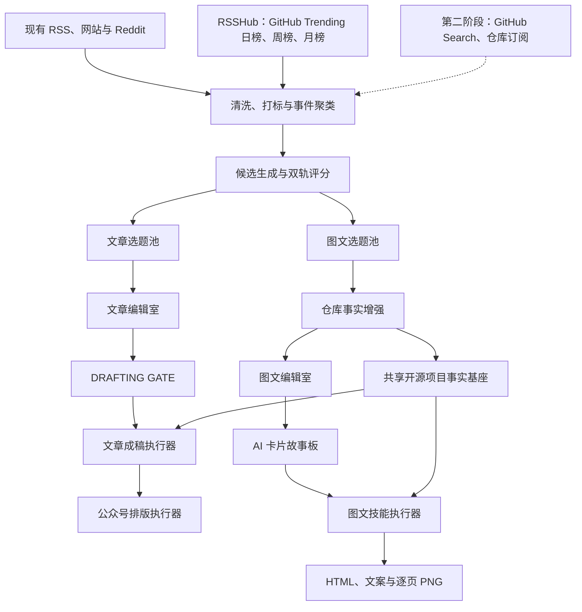

# 文章选题池与图文选题池双轨方案

> 状态：已实施（P0–P4 主链路完成）  
> 版本：v1.3  
> 日期：2026-07-23

> 当前验收结论：文章与图文双轨、GitHub 发现、仓库事实核验、Social Fit 预选、图文故事板、技能执行器、HTML/PNG/ZIP 交付、产物中心和内容日历已经形成完整闭环。仓库订阅、自动发布、单页定向重绘、多任务并行和非仓库类自定义图文仍属于可选扩展，不阻塞当前版本验收。

## 1. 背景

项目当前以公众号文章为主要生产对象。热点经过采集、打标、研判和候选筛选后，统一进入文章编辑室，再依次运行成稿和公众号排版链。

实际内容中相当一部分是基于 GitHub 等开源仓库制作的工具推荐。这类选题既适合公众号长文，也适合小红书图文或公众号工具贴图，但两类内容的选题标准、编辑门禁和最终产物并不相同。

本方案将候选生产拆成文章和图文两条轨道，同时继续共享采集、清洗、打标、热点聚类和来源数据。

## 2. 设计目标

1. 采集、清洗、打标和热点聚类继续使用一套流程。
2. 选题阶段提供“文章选题池”和“图文选题池”。
3. 同一个候选可以只进入一个池，也可以同时进入两个池。
4. 两条生产轨道拥有独立评分、状态、门禁、任务和产物。
5. 开源项目事实只核验一次，供文章和图文共同使用。
6. 图文生产正式采用项目内技能契约和独立执行器。
7. 第一阶段优先支持公众号工具贴图，稳定后再开放完整小红书模式。
8. 页面信息架构明确区分“内容发现”“文章生产”“图文生产”和“系统管理”。
9. GitHub Trending 直接复用已验证的本地 RSSHub 路由；Search API 和仓库订阅延后实施。

## 3. 非目标

第一阶段不包含：

- 自动发布到小红书或微信公众号。
- 多套视觉风格的完整可视化编辑器。
- 单页局部 AI 重绘。
- 多个图文任务同时运行。
- ZIP 打包下载。
- 将所有热点自动加入图文池。
- GitHub Search API 和仓库订阅（移至第二阶段）。

## 4. 目标流程



## 5. 页面信息架构

双轨方案会改变选题之后的页面结构，但不需要推翻采集、热点和系统管理页面。侧边导航按工作目标分组：

```text
内容发现
  工作台总览
  批次管理
  热点全景
  采集源

文章生产
  文章选题池
  文章编辑室
  文章编辑器
  公众号排版

图文生产
  图文选题池
  图文编辑室
  图文产物

系统
  模型中心
  任务日志
  产物中心
```

### 5.1 页面调整原则

- 总览、批次、采集源、热点全景、模型和任务日志继续共用。
- 当前“选题池”明确改名为“文章选题池”。
- 图文生产新增独立选题池、编辑室和产物页。
- 不使用全局“文章/图文”开关替换整套导航，避免页面和状态含义随模式变化。
- 当前批次继续作为全局上下文，两条生产轨道共享同一个批次。
- 同一候选在热点卡片和候选卡片上同时显示文章、图文两条状态。

### 5.2 热点全景操作

热点或事件卡片提供：

- 加入文章池
- 加入图文池
- 同时加入
- 已加入轨道状态

第一阶段采用“独立图文预选 + AI 建议 + 人工调整”：图文预选直接面向全量事件运行，不依赖文章核心 8 条和黑马 2 条，优先选择 GitHub Trending 中用途明确、可演示、具备国内读者价值的仓库与工具；文章脑暴中明确建议 `format=贴图`、`github_tool` 或 `ai_tool_test` 的候选也可补充进入。普通新闻、用途不明仓库、高风险、`NO_ANGLE` 和 `SKIP` 候选不自动进入，编辑仍可手工加入或单轨移除。

### 5.3 工作台总览

总览指标调整为：

```text
热点数量 | 文章候选 | 图文候选 | 文章生产中 | 图文生产中 | 待审核产物
```

最近 AI 任务增加：

```text
repository-inspect | social-cards
```

### 5.4 统一产物中心

不新建第二套全局产物中心。现有产物中心增加筛选：

```text
全部 | 文章 | 排版 | 图文 | 事实基座
```

“图文产物”页面负责单个候选的生产与画廊，“产物中心”继续负责跨批次统一查询。

## 6. 候选与生产轨道

### 6.1 保留统一候选主体

继续使用现有 `candidates` 作为热点候选主体，不复制两份候选数据。

新增 `candidate_tracks`：

```sql
CREATE TABLE candidate_tracks (
  id INTEGER PRIMARY KEY AUTOINCREMENT,
  candidate_row_id INTEGER NOT NULL,
  track TEXT NOT NULL,                  -- article | social_cards
  status TEXT NOT NULL DEFAULT 'pooled',
  score REAL,
  pool_role TEXT NOT NULL DEFAULT '',
  output_mode TEXT NOT NULL DEFAULT '', -- wechat-tool-cards | xiaohongshu
  selected_at TEXT NOT NULL,
  locked_at TEXT,
  updated_at TEXT NOT NULL,
  UNIQUE(candidate_row_id, track),
  FOREIGN KEY(candidate_row_id) REFERENCES candidates(id) ON DELETE CASCADE
);
```

### 6.2 兼容现有数据

数据库迁移时，为所有已有候选补充：

```text
track = article
status = candidates.status
```

迁移初期保留 `candidates.status` 作为文章轨道兼容字段。新代码优先读取 `candidate_tracks`，待所有调用完成迁移后再考虑移除旧字段。

### 6.3 分流操作

热点和候选支持：

- 加入文章池
- 加入图文池
- 同时加入
- 只移出文章池
- 只移出图文池
- 从两个池彻底删除候选

## 7. 双轨评分

### 7.1 文章轨道

继续使用现有文章评分体系和 H/B/P/S/D/F 结果，关注：

- 核心命题与冲突
- 国内读者相关度
- 信息增量
- 作者观点空间
- 事实支撑
- 长文结构潜力

### 7.2 图文轨道

新增图文适配评分，不直接复用文章最终分：

```text
图文适配分 =
  工具对象明确度
+ 场景具体度
+ 操作可演示性
+ 视觉拆页能力
+ 搜索与收藏价值
+ 来源完整度
- 事实缺口
- 权限风险
- 同质化扣分
```

建议输出字段：

```json
{
  "toolClarity": 0,
  "scenarioValue": 0,
  "demonstrability": 0,
  "visualPotential": 0,
  "saveSearchValue": 0,
  "sourceCompleteness": 0,
  "factGapPenalty": 0,
  "permissionRiskPenalty": 0,
  "saturationPenalty": 0,
  "finalScore": 0,
  "recommendedPages": 0,
  "recommendedModes": ["wechat-tool-cards"]
}
```

## 8. GitHub 采集与开源仓库事实增强

GitHub 能力分为“发现源”和“事实增强”两层。GitHub Trending 已通过本地 RSSHub 实例验证，第一阶段即可作为低成本主动发现源接入；选中候选后再通过 GitHub API 完成事实增强。Search API 和仓库订阅不作为第一阶段前置条件。

### 8.1 GitHub Trending 主动发现源（第一阶段）

不再开发或维护 GitHub Trending HTML 解析器。直接复用现有 RSSHub 采集器，增加以下路由：

```text
/github/trending/daily/any
/github/trending/weekly/any
/github/trending/monthly/any
```

需要按技术栈细分时，可按需增加：

```text
/github/trending/daily/python
/github/trending/daily/typescript
/github/trending/daily/javascript
```

组件职责：

| 组件 | 职责 |
|---|---|
| 现有 RSSHub 采集器 | 拉取 GitHub Trending 日榜、周榜和月榜，并复用现有去重、批次和来源健康检查 |
| RSSHub GitHub Trending 路由 | 从 Trending 页面取得榜单，再通过 GitHub GraphQL API 补充公开仓库元数据 |
| `repository-inspector` | 对初筛或选中的仓库获取 README、LICENSE、Release 等可审计事实 |
| GitHub Search（第二阶段可选） | 发现近期新建、更新和快速增长但尚未进入 Trending 的仓库 |

GitHub 官方 API 没有与 Trending 网页完全等价的接口，因此采用分层策略：

- RSSHub Trending 路由用于取得真实日榜、周榜和月榜，项目不直接依赖 GitHub 页面 DOM。
- 现有 RSSHub 来源适配层负责统一采集、去重和失败隔离。
- 仓库详情 API 用于事实增强，不承担 Trending 排名。
- Search API 仅作为第二阶段的补充发现机制，不阻塞双池和图文生产闭环。

建议只对初筛后的前 30–50 个仓库做深度增强，避免一次发现数百个仓库后产生上千次 API 请求。

统一写入现有热点库：

```json
{
  "source": "github",
  "source_group": "github",
  "source_type": "trending",
  "source_name": "GitHub Trending · Weekly",
  "title": "owner/repository",
  "url": "https://github.com/owner/repository",
  "raw_json": {
    "repository": "owner/repository",
    "language": "TypeScript",
    "stars": 1234,
    "periodStars": 256,
    "period": "weekly",
    "topics": []
  }
}
```

### 8.2 GitHub Search 与仓库订阅（第二阶段可选）

Search API 可使用创建时间、更新时间、Topics 和 Star 条件发现增长项目，用于补充尚未进入 Trending 的潜力项目。其结果仍写入统一热点库，但必须与 Trending 来源区分，不能伪装成榜单排名。

采集源中心允许订阅 `owner/repository`，监控：

- 新 Release
- Star 明显增长
- README 重大变化
- 仓库归档或停止维护
- 新增重要功能

仓库订阅不是第一阶段图文闭环的前置条件。

### 8.3 GitHub 认证、限流与缓存

新增服务端环境变量：

```text
GITHUB_ACCESS_TOKEN
```

该变量配置给 RSSHub 服务端进程，使用只具备公开仓库元数据读取能力的低权限 Token，不下发浏览器，也不写入项目配置或版本库。RSSHub 重启后应验证以下地址返回有效 Feed：

```text
http://127.0.0.1:1200/github/trending/daily/any
```

项目侧 GitHub API 客户端必须：

- 读取 `x-ratelimit-*` 和 `retry-after` 响应头。
- 为 Search 和普通 REST 请求分别记录限流状态。
- 使用 ETag、`If-None-Match` 和本地缓存减少重复请求。
- 对 `403`、`429` 和临时网络错误执行受限退避，不无限重试。
- 在采集源健康状态中显示剩余配额和重置时间。

### 8.4 选中后的事实增强（第一阶段）

新增 `server/platform/integrations/repository-inspector.mjs`，对 GitHub 或其他公开仓库建立可审计事实基座。

建议产物：

```text
repository-fact-sheet.json
fact-sheet.md
```

核心结构：

```json
{
  "repository": "",
  "sourceUrl": "",
  "description": "",
  "stars": { "value": null, "checkedAt": "", "source": "" },
  "license": { "type": "", "source": "" },
  "latestRelease": { "version": "", "publishedAt": "", "source": "" },
  "installation": [],
  "supportedPlatforms": [],
  "coreCapabilities": [],
  "limitations": [],
  "permissions": [],
  "networkAccess": [],
  "maturity": "unknown",
  "verifiedSources": [],
  "warnings": []
}
```

核验要求：

- Star 等实时数字必须记录采集时间。
- 开源协议以仓库 LICENSE 为准。
- 安装命令以官方 README 或 Release 页面为准。
- Alpha、Beta、实验状态必须显式保留。
- 不得把项目愿景改写成已经实现的功能。
- 未实际运行时不得生成“亲测”“我用了”等体验表述。
- 仓库脚本、网络访问、文件系统权限和 API Key 要求需要进入风险说明。

## 9. 图文编辑室与故事板就绪门禁

图文轨道使用独立编辑界面，不复用文章编辑室的长文决策字段。

仓库核验后由 AI 在后台自动形成以下结构化决策：

- 目标读者
- 核心痛点
- 工具定位
- 必须突出能力
- 必须说明限制
- 安装或开始入口
- 禁止表达
- 输出模式
- 视觉风格

这些字段不作为人工表单展示；界面只展示仓库事实、图文适配分和卡片故事板。用户可以重新生成故事板，确认后直接生成图文，无须锁定简报。

故事板就绪门禁至少检查：

1. 仓库或产品地址已确认。
2. 核心能力均有来源支持。
3. 安装步骤已核验，或明确改为“使用前检查”。
4. LICENSE 已确认或明确标记未知。
5. 项目成熟度已确认。
6. 权限和网络访问边界已说明。
7. 不包含虚构体验、效果、数字和收益。
8. 能规划出至少 4 页不重复卡片。

## 10. 图文技能迁移

迁移 `xiaohongshu-article-generator` 到项目 `skills/`。

该技能的重要规范位于技能根目录：

- `COPY_GUIDE.md`
- `TITLE_GUIDE.md`
- `DESIGN_SYSTEM.md`

当前 `loadSkillBundle()` 只读取 `SKILL.md` 和 `references/**/*.md`，因此不能只复制目录。实施时应选择以下方案之一：

1. 将上述规范移动至 `references/`。
2. 扩展技能运行时，支持由技能声明加载根目录附属 Markdown。

推荐方案 2，使项目技能运行时更接近 Codex 的渐进式技能加载方式。

## 11. 图文正式执行器

新增：

```text
server/platform/llm/social-card-pipeline.mjs
```

建议阶段契约：

| 阶段 | 输入 | 输出 |
|---|---|---|
| facts | 候选、来源、仓库信息 | `fact-sheet.md`、`repository-fact-sheet.json` |
| planning | 事实清单、编辑决策 | `card-plan.json` |
| copy | 事实清单、卡片规划 | `copy.txt`、标题候选 |
| html | 规划、文案、设计规范 | `my-design.html` |
| audit | HTML | `layout-report.json` |
| repair | 审计问题、HTML | 修复后的 `my-design.html` |
| screenshot | 审计通过的 HTML | `output/page-*.png` |
| delivery | 全部产物 | 技能清单、阶段执行清单、产物索引 |

布局审计最多自动迭代三轮。连续两轮同一问题没有改善时停止，保留报告并将任务标记为失败，不得通过缩放、隐藏溢出或空白卡绕过门禁。

## 12. 后台任务与 API

新增任务类型：

```text
social-cards
repository-inspect
```

建议接口：

```text
GET    /api/batches/:batchId/candidates?track=article
GET    /api/batches/:batchId/candidates?track=social_cards
POST   /api/candidates/:id/tracks
DELETE /api/candidates/:id/tracks/:track
GET    /api/candidates/:id/card-editorial
PUT    /api/candidates/:id/card-editorial
POST   /api/candidates/:id/repository/inspect
POST   /api/candidates/:id/ai/card-editorial
POST   /api/candidates/:id/ai/social-card
GET    /api/candidates/:id/social-cards
```

当前 AI 任务按批次全局互斥。正式版应将互斥键改为：

```text
batchId + candidateId + track
```

同一候选同一轨道禁止重复执行，但不同候选或不同轨道可按配置决定是否并行。

## 13. 产物模型与预览

建议为 `artifacts` 增加：

```text
candidate_row_id
track
```

避免继续根据文件路径推断产物属于哪个候选。

图文产物目录：

```text
social-cards/<批次日期>-<候选编号>/
  fact-sheet.md
  repository-fact-sheet.json
  card-plan.json
  copy.txt
  my-design.html
  layout-report.json
  skill-manifest.json
  stage-executions.json
  output/page-01.png ...
```

产物页第一阶段提供：

- 逐页 PNG 画廊
- 上一页、下一页
- 单张下载
- 查看 `copy.txt`
- 查看事实清单
- 查看布局审计报告
- 整组重新生成

## 14. 分阶段实施

### P0：信息架构与双轨基础

> 实施状态：已完成（2026-07-22）

- 侧边导航分成内容发现、文章生产、图文生产和系统
- 当前选题池改名为文章选题池
- 新增 `candidate_tracks`
- 迁移已有候选为文章轨道
- 候选接口支持轨道过滤
- 增加文章池和图文池
- 支持加入、同时加入、单轨移除
- 总览增加双轨指标和任务类型

预计人工工作量：14–20 小时。

### P1：图文决策与事实门禁

> 实施状态：已完成（2026-07-22）

- 新增仓库事实增强
- 新增图文适配评分
- 新增图文编辑室
- 新增 `CARD GATE`
- 生成并登记事实基座
- 仓库核验后由 AI 根据 README 与事实基座自动生成受众、痛点、定位、能力、安装入口、限制和 4～7 页卡片故事板；人工只负责复核、补充真实体验与覆盖账号约束

预计人工工作量：12–18 小时。

### P2：技能与正式执行器

> 实施状态：已完成（2026-07-22）

- ✅ 迁移 `xiaohongshu-article-generator` 为项目内正式技能契约
- ✅ 扩展技能加载器，读取技能根目录规范与 `references/`
- ✅ 新增 `social-card-pipeline.mjs` 六阶段执行器
- ✅ 接入浏览器布局审计、最多三轮 AI 定向修复和逐页截图
- ✅ 接入后台任务日志、失败记录与原任务可重跑恢复

预计人工工作量：14–22 小时。

### P3：预览与交付

> 实施状态：已完成（2026-07-22）

- ✅ 产物增加候选和轨道关联，并回填现有图文目录
- ✅ 增加带胶片缩略图、上一张/下一张的 PNG 画廊
- ✅ 增加文案、事实和审计报告预览
- ✅ 增加单张 PNG、HTML、整组 ZIP 下载与整组重跑
- ✅ 补齐产物关联、ZIP、交付界面和浏览器布局测试

预计人工工作量：10–15 小时。

### P4：GitHub 发现增强

> 实施状态：主范围已完成（2026-07-22）；仓库订阅与 Release 持续监控按决策暂不实施。

- ✅ 通过现有 RSSHub 采集器增加 GitHub Trending 日榜、周榜和月榜
- ✅ 完成 Trending Feed 到统一热点库的字段映射、跨周期去重和来源健康验证
- ✅ 增加 Search API 增长项目发现：最近 30 天创建、Star ≥ 1000，并补充其他热点中提及的仓库
- ✅ 增加 GitHub API Token 认证、配额读取、ETag 缓存、受限重试和健康状态
- ✅ 将 GitHub 仓库规范化写入统一热点库，并保留周期及周期排名
- 可选增加仓库订阅和 Release 监控

仅接入已验证的 RSSHub Trending 路由预计人工工作量：1–3 小时。  
增加 Search API、完整限流看板，不含仓库订阅时预计人工工作量：6–10 小时。  
包含仓库订阅时预计人工工作量：11–20 小时。

## 15. 实施成本汇总

| 版本 | 范围 | 人工工时 |
|---|---|---:|
| 纵向验证版 | 导航分组、双池、手工分流、仓库核验、公众号工具卡、基本预览 | 30–45 小时 |
| 正式双轨版 | 独立评分、完整 CARD GATE、产物关联、完整预览与测试 | 55–80 小时 |
| RSSHub Trending 版 | 正式双轨版 + GitHub Trending | 56–83 小时 |
| GitHub 发现增强版 | RSSHub Trending 版 + Search API | 61–90 小时 |
| 完整双渠道版 | GitHub 发现增强版 + 仓库订阅 + 小红书模式 | 77–111 小时 |

预计改动量：

- 新增文件：13–21 个
- 修改文件：12–18 个
- 应用代码：约 2300–3700 行
- 测试代码：约 450–750 行
- 新增数据库表：2–3 张
- 已有表新增字段：2–4 个

以上为传统人工开发工时，不代表使用 Codex 协作时的实际完成时间。

## 16. 主要风险

### 16.1 单一候选状态耦合

当前大量逻辑默认 `candidates.status` 就是文章生命周期。双轨实施时必须逐步迁移，避免图文状态覆盖文章状态。

### 16.2 仓库事实不完整

GitHub API 限流、仓库归档、README 缺失、非 GitHub 地址和动态安装步骤都可能导致事实门禁无法通过。系统必须允许明确标记未知，而不是让模型补写。

### 16.3 HTML 生成不稳定

图文 HTML 由模型生成时可能出现溢出、空白和结构缺失。必须保留确定性布局审计、有限修复次数和失败报告。

### 16.4 任务和产物归属

现有任务以批次互斥，产物主要通过批次和路径归属。双轨正式版需要候选和轨道级关联，避免错误展示或相互阻塞。

### 16.5 文案规范冲突

小红书规范中的情绪词、数字钩子和体验表达不得覆盖事实门禁。技能执行器必须始终以来源和作者真实体验为最高约束。

### 16.6 页面信息架构膨胀

双轨会增加导航和页面数量。必须坚持共享上游、分离下游，不复制批次、热点、模型、任务日志和全局产物中心。

### 16.7 GitHub 限流与来源稳定性

RSSHub Trending 路由内部仍依赖 GitHub Trending 页面和 GraphQL API，因此页面变化、Token 过期或 API 限流都可能导致采集失败。项目必须复用来源降级、缓存和健康状态，区分 RSSHub 路由失败与 GitHub API 配额问题，不能让单一 GitHub 来源失败阻塞其他采集源。第二阶段启用 Search API 后，还需单独记录其限流状态。

## 17. 推荐实施路线

### 17.1 第一阶段：验证图文闭环

- 侧边导航完成四组信息架构
- 文章选题池与图文选题池
- 同一候选支持双轨
- 研判后自动加入明确适合贴图或工具卡的低风险候选，并允许人工调整
- 通过 RSSHub 接入 GitHub Trending 日榜、周榜和月榜
- GitHub 仓库事实核验
- 图文编辑室和 `CARD GATE`
- 仅支持 `wechat-tool-cards`
- 生成 HTML、`copy.txt` 和逐页 PNG
- 产物页画廊和单张下载

第一阶段继续使用现有 RSS、网站和 Reddit 来源，同时以低成本方式接入已验证的 RSSHub GitHub Trending 路由。目标仍是优先验证图文选题、门禁和产物是否满足真实运营需要，不让 Search API 或仓库订阅阻塞闭环。

### 17.2 第二阶段：扩大开源项目供给

第一阶段稳定后增加：

- GitHub Search API
- 图文自动适配评分
- 采集源健康状态和限流展示
- 可选仓库订阅

### 17.3 第三阶段：扩展渠道和交付能力

- 完整小红书模式
- 渠道切换
- ZIP 下载
- 单页定向重生成
- 可控的多任务并行

## 18. 验收标准

1. 现有候选和文章生产链在迁移后不丢失、不改变状态。
2. 一个候选可以同时存在于文章池和图文池。
3. 从一个池移除不会影响另一个池。
4. 图文轨道没有通过事实与故事板就绪门禁时不能启动生成；通过后无须锁定即可生成。
5. 所有确定性仓库事实都包含来源和核验时间。
6. 生成产物包含事实清单、卡片规划、文案、HTML、审计报告和 PNG。
7. PNG 数量与 HTML 页面数量一致。
8. 布局审计失败时不得登记为已完成产物。
9. 文章任务和图文任务的状态、日志和产物互不覆盖。
10. 旧批次、旧候选和现有 文章/排版 测试全部通过。
11. 侧边导航能明确区分文章和图文生产，公共页面不重复。
12. 总览能分别统计文章候选、图文候选和两类生产任务。
13. RSSHub GitHub Trending 日榜、周榜和月榜能写入统一热点库并保留来源与周期字段。
14. 单一 GitHub 或 RSSHub 路由失败不会阻塞其他来源。
15. GitHub API 配额、重置时间和缓存命中情况可审计。

## 19. 待决策事项

- 第一阶段是否只开放 `wechat-tool-cards`。
- 图文池候选是完全手工加入，还是研判后自动推荐、人工确认。
- 是否允许文章与图文任务并行。
- 是否第一阶段就为 `artifacts` 增加候选和轨道字段。
- 默认视觉风格使用 `ice-blue`，还是根据工具类型自动选择。
- 是否在第二阶段启用 GitHub Search API 补充 Trending 之外的增长项目。
- 仓库订阅是否与 Search API 同期实施。

## 20. 可选功能扩展 TODO

可选扩展已迁移至独立清单：[可选功能扩展 TODO](./optional-feature-todos.md)。本方案只保留 P0–P4 已验收范围；TODO 清单中的功能不计入当前仓库图文闭环的完成标准。
