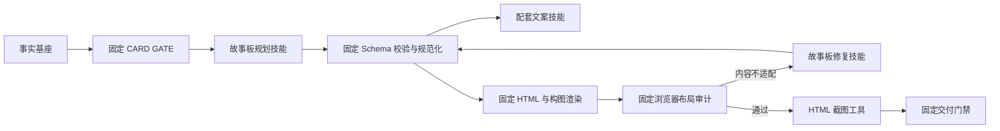

# 图文故事板技能化改造方案

> 日期：2026-07-29  
> 状态：待实施  
> 范围：工具图文、事件图文、自定义图文的故事板规划与后续图文生成链路

## 1. 背景与问题

当前图文生成是“技能 Prompt + 路由硬编码 + 确定性渲染”的混合实现。

已经由技能承载的部分：

- `repository-card-storyboard`、`event-card-storyboard`、`custom-card-storyboard` 分别负责工具、事件和自定义图文规划；`xiaohongshu-article-generator` 负责已锁定故事板之后的文案、渲染、审计、截图与交付。
- 模型生成目标读者、内容定位、逐页故事板和配套文案。
- 布局修复阶段复用该技能 Prompt。
- `html-pages-to-images` 负责把可信 HTML 中的 `.page` 截图为 PNG。

仍硬编码在程序中的部分：

- 仓库、事件和自定义图文的故事板系统 Prompt。
- 各内容类型的页序、页数、内容块和披露要求。
- 公众号与小红书渠道附加 Prompt。
- 拆分前故事板生成固定绑定 `xiaohongshu-article-generator`，现已由独立故事板槽位解析。
- 技能页面不能为故事板阶段设置默认技能。
- 图文页面不能为当前任务选择其他兼容故事板技能。

因此，用户即使安装了新的图文技能，也只能被注册中心发现，不能替换故事板规划方式；修改 `SKILL.md` 的影响范围也不清晰。

## 2. 改造目标

本次改造遵循“创意可扩展，交付确定性”的边界。

### 2.1 允许扩展

- 故事线选择。
- 目标读者与内容定位。
- 页数建议与逐页职责。
- 每页标题、证据和内容块。
- 发布配套文案。
- 布局失败后的内容级修复策略。

### 2.2 继续固定

- 事实基座构建和来源等级。
- `CARD GATE`。
- 故事板 Schema 校验和安全清洗。
- 页面尺寸、HTML 骨架和 CSS 安全边界。
- 构图注册表与确定性回退。
- 浏览器布局审计。
- HTML 截图和交付一致性门禁。
- 外部上传与发布授权。

技能不得输出可执行代码、任意 HTML、CSS、坐标或本地路径。

## 3. 目标架构



运行时优先级统一为：

```text
本次任务显式选择
→ 当前入口的阶段默认
→ 内置默认技能
```

生成任务启动后，将实际技能版本、完整 Prompt、配置、工具、模型和选择来源冻结进 generation snapshot。历史重试默认继续使用原快照。

## 4. 技能槽位设计

首期提供三个图文阶段槽位。

| 槽位 | 角色 | 默认技能 | 输入契约 | 输出契约 |
| --- | --- | --- | --- | --- |
| 故事板规划 | `storyboard` | 按入口使用三个独立内置技能 | `social_card_fact_base` | `social_card_storyboard` |
| 配套文案 | `social-copy` | `xiaohongshu-article-generator` | `social_card_storyboard` | `social_post_copy` |
| 故事板修复 | `storyboard-repair` | 跟随故事板规划技能 | `social_card_layout_report` | `social_card_storyboard` |

首期建议把“故事板规划”和“配套文案”开放为可选槽位。修复槽位默认跟随故事板技能，避免规划与修复规则互相冲突；等契约稳定后再允许独立替换。

### 4.1 创作入口

新增或复用以下 entry point：

| entry point | 页面 | 内容类型 |
| --- | --- | --- |
| `social-tool` | 工具图文 | `repository` |
| `social-event` | 事件图文 | `event` |
| `social-custom` | 自定义图文 | `tutorial`、`list`、`opinion` |

一个技能可以声明多个入口，但必须明确支持的 `contentTypes` 和渠道。

### 4.2 Manifest 示例

```json
{
  "schemaVersion": 1,
  "id": "viral-social-storyboard",
  "name": "爆款图文故事板",
  "version": "1.0.0",
  "kind": "storyboard",
  "entryPoints": ["social-tool", "social-event", "social-custom"],
  "contentTypes": ["repository", "event", "tutorial", "list", "opinion"],
  "inputContract": "social_card_fact_base",
  "outputContract": "social_card_storyboard",
  "requiredCapabilities": [],
  "optionalCapabilities": [],
  "compatibleApp": ">=0.1.0",
  "source": {
    "type": "installed",
    "url": ""
  }
}
```

`skill.json` 只声明可确定性解析的路由信息。具体故事板方法、文风和内容策略写在 `SKILL.md`。

## 5. 输入输出契约

### 5.1 统一事实输入

程序将三类事实基座转换为统一信封，原始类型数据保留在 `facts` 中：

```json
{
  "schemaVersion": 1,
  "entryPoint": "social-tool",
  "contentType": "repository",
  "channelMode": "xiaohongshu",
  "topic": "文章或项目主题",
  "facts": {},
  "sources": [],
  "editorialDecisions": {},
  "constraints": {
    "minPages": 4,
    "maxPages": 7,
    "allowedBlockTypes": ["text", "list", "code", "note"],
    "pageWidth": 375,
    "pageHeight": 667
  },
  "disclosure": {
    "required": true,
    "text": "基于项目文档整理，未实际运行"
  }
}
```

技能只能依据该信封生成内容，不能自行读取本地文件、网络或数据库。若技能需要外部信息，必须在 manifest 中声明工具能力并通过运行时白名单调用。

### 5.2 故事板输出

```json
{
  "schemaVersion": 1,
  "targetReader": "",
  "painPoint": "",
  "positioning": "",
  "mustHighlight": [],
  "mustDisclose": [],
  "forbiddenClaims": [],
  "recommendedPages": 6,
  "pages": [
    {
      "kind": "cover",
      "role": "cover",
      "title": "",
      "goal": "",
      "evidence": [
        {
          "sourceId": "source-1",
          "claim": ""
        }
      ],
      "contentBlocks": [
        {
          "type": "text",
          "title": "",
          "content": ""
        }
      ],
      "compositionHint": {
        "id": "",
        "columns": "single",
        "flow": "stack",
        "alignment": "center",
        "decoration": "none",
        "overlap": "none"
      }
    }
  ]
}
```

程序继续负责：

- 页数上下限。
- `kind`、`role`、内容块类型枚举。
- 每页内容块数量和字段长度。
- `evidence.sourceId` 是否存在。
- 数字和具体断言是否能被事实基座支持。
- 清除“让读者了解”等内部指令表达。
- 丢弃非法构图字段并使用注册表补齐。
- 禁止 HTML、CSS、脚本、坐标和本地路径。

### 5.3 配套文案输出

建议使用结构化结果，避免再用纯文本猜测渠道组成：

```json
{
  "title": "",
  "body": "",
  "hashtags": [],
  "callToAction": ""
}
```

公众号渠道强制 `hashtags=[]`；小红书渠道允许 6–8 个合规标签。最终的 `copy.txt` 由固定代码组装。

### 5.4 修复输入

```json
{
  "storyboard": {},
  "layoutReport": {
    "valid": false,
    "pages": [
      {
        "page": 2,
        "issues": ["overfilled"]
      }
    ]
  },
  "repairConstraints": {
    "keepPageCount": true,
    "keepPageOrder": true,
    "keepFacts": true,
    "keepTitlesWhenPossible": true
  }
}
```

修复结果仍必须通过完整 `social_card_storyboard` Schema，且不得增加事实或改变页数。

## 6. Prompt 迁移

将 `social-card-routes.mjs` 中的三类故事板 Prompt 移出路由。

建议目录：

```text
skills/
  repository-card-storyboard/
  event-card-storyboard/
  custom-card-storyboard/
    SKILL.md
    references/
      storyboard-contract.md
      repository-storyboard.md
      event-storyboard.md
      custom-storyboard.md
      channel-wechat.md
      channel-xiaohongshu.md
      layout-repair.md
```

迁移原则：

- `SKILL.md`：总体职责、事实纪律、流程和输出要求。
- 内容类型 reference：仓库、事件、自定义内容的故事线策略。
- 渠道 reference：公众号和小红书的表达差异。
- `layout-repair.md`：内容级布局修复规则。
- 程序只注入当前阶段、结构化输入、允许枚举和确定性限制。
- 不在代码中复制技能 Prompt 正文。

为了避免一次迁移改变现有产出，P0 应先将当前硬编码文字原样迁入 references，并使用快照测试比较迁移前后的最终 system prompt。

## 7. 运行时与数据模型

### 7.1 槽位定义

在技能路由层新增：

```js
SOCIAL_CARD_SKILL_SLOTS = [
  {
    id: "storyboard",
    kind: "storyboard",
    inputContract: "social_card_fact_base",
    outputContract: "social_card_storyboard",
    defaultSkillIds: {
      "social-tool": "repository-card-storyboard",
      "social-event": "event-card-storyboard",
      "social-custom": "custom-card-storyboard"
    }
  },
  {
    id: "copy",
    kind: "social-copy",
    inputContract: "social_card_storyboard",
    outputContract: "social_post_copy",
    defaultSkillId: "xiaohongshu-article-generator"
  }
]
```

### 7.2 默认映射

沿用现有 `stageDefaults`：

```json
{
  "stageDefaults": {
    "social-tool": {
      "storyboard": "viral-social-storyboard",
      "copy": "social-copywriter"
    },
    "social-event": {
      "storyboard": "event-explainer-storyboard"
    }
  }
}
```

停用或卸载第三方技能时清理对应映射。默认技能不可用时回退内置技能；用户本次显式选择不可用时阻断任务启动。

### 7.3 Generation snapshot

图文任务快照增加：

```json
{
  "selection": {
    "entryPoint": "social-tool",
    "contentType": "repository",
    "stages": {
      "storyboard": {
        "requestedSkill": "",
        "selectedSkill": "viral-social-storyboard",
        "selectionSource": "workspace-default"
      },
      "copy": {
        "requestedSkill": "social-copywriter",
        "selectedSkill": "social-copywriter",
        "selectionSource": "user"
      }
    }
  }
}
```

故事板决策和最终图文生成必须共享同一个阶段选择。避免编辑阶段使用技能 A，正式生成阶段又回到内置技能 B。

## 8. API 设计

```text
GET /api/creation-entry-points/:entryPoint/social-card-stage-skills
PUT /api/system/skill-stage-defaults/:entryPoint/:slot
POST /api/candidates/:id/ai/card-editorial
POST /api/candidates/:id/ai/social-card
```

`card-editorial` 请求：

```json
{
  "provider": "",
  "stageSkills": {
    "storyboard": "viral-social-storyboard",
    "copy": "social-copywriter"
  }
}
```

`social-card` 请求默认复用已锁定故事板的 generation snapshot。只有用户明确选择“按最新技能重新规划”时才创建新的技能解析结果。

## 9. 页面交互

图文编辑室增加与文章入口一致的“本次创作配置”：

- 摘要显示“默认故事板 · 默认配套文案”。
- 展开后选择“故事板规划技能”和“配套文案技能”。
- 显示“工作区默认、内置、已安装”和不可用原因。
- 支持恢复默认。
- 生成故事板后锁定本次选择。
- 若用户在已生成故事板后切换技能，明确提示“需要重新生成故事板，现有逐页编辑会被替换”。
- 仅修改版式、视觉主题和逐页文案时，不重新解析技能。

技能详情页的“设为默认”支持：

- 工具图文 / 故事板规划。
- 事件图文 / 故事板规划。
- 自定义图文 / 故事板规划。
- 对应入口 / 配套文案。

## 10. 分阶段实施过程

### P0：契约与 Prompt 迁移（已完成）

目标：不改变现有用户体验和输出，只消除路由中的大段 Prompt。

1. 新增故事板、配套文案和布局报告 JSON Schema。
2. 把仓库、事件、自定义、渠道和修复规则迁入技能 references。
3. 新增统一事实输入信封转换器。
4. 保持 `xiaohongshu-article-generator` 为唯一默认技能。
5. 增加迁移前后 Prompt 等价测试。
6. 保持当前 HTML、构图、截图和门禁代码不变。

验收：

- 路由不再包含完整故事板方法正文。
- 三类图文现有测试全部通过。
- 同一固定输入的故事板系统 Prompt 语义规则无缺失。

实施记录（2026-07-29）：

- 新增 `server/domain/social-card-storyboard-contracts.mjs`，统一事实信封、旧输入兼容适配和阶段 Prompt 组装均由该模块负责。
- 新增 `social_card_fact_base`、`social_card_storyboard`、`social_card_layout_report` 三项 JSON Schema。
- P0 首次迁移时上述规则位于 `xiaohongshu-article-generator/references/storyboard/`；P1 后已进一步按入口迁入三个独立故事板技能。
- `social-card-routes.mjs` 不再保存完整故事板方法正文，只注入当前内容、渠道和事实输入。
- P0 仍固定使用内置 `xiaohongshu-article-generator`；统一事实信封通过兼容适配器还原为迁移前的 user JSON，HTML、构图、截图和门禁链路未改动。
- 新增六种“内容类型 × 渠道”Prompt 语义快照及三入口事实信封测试；图文相关定向测试通过。

### P1：故事板技能槽位（已完成）

目标：允许安装的兼容技能参与故事板规划。

1. 扩展 manifest `kind`：`storyboard`。
2. 实现 `listSocialCardStageSkillSlots()`。
3. 实现 `resolveSocialCardStageSkills()`。
4. 接入角色、入口、内容类型、契约、工具和启用状态校验。
5. `card-editorial` 接收 `stageSkills.storyboard`。
6. 将选择结果冻结进 generation snapshot。
7. 旧快照缺少阶段选择时使用内置技能兼容。

验收：

- 兼容第三方技能可生成故事板。
- 不兼容技能不能选择。
- 显式技能不可用时给出具体错误。
- 安装技能不会自动接管流程。

实施记录（2026-07-29）：

- 技能清单新增 `storyboard` 角色，并为三个入口提供相互隔离的内置默认实现。
- 新增 `SOCIAL_CARD_SKILL_SLOTS`、`listSocialCardStageSkillSlots()` 和 `resolveSocialCardStageSkills()`。
- 三个入口分别校验 `repository`、`event` 以及 `tutorial/list/opinion` 内容类型，并校验输入输出契约、启用状态和必需工具能力。
- 新增 `GET /api/creation-entry-points/:entryPoint/social-card-stage-skills`，用于查询当前入口的候选故事板技能及不可用原因。
- `POST /api/candidates/:id/ai/card-editorial` 已接受 `stageSkills.storyboard`；显式选择不可用时阻止生成，未选择或配置默认不可用时回退内置实现。
- 实际技能 ID、选择来源、完整阶段 Prompt、模型与工具均写入 generation snapshot。
- P1 只完成后端槽位和运行时闭环；图文编辑室的单次选择器与默认设置交互在 P2 实施。

P1 后拆分记录（2026-07-29）：

- 新增 `repository-card-storyboard`、`event-card-storyboard` 和 `custom-card-storyboard`，分别只服务一个图文入口。
- 仓库、事件和自定义故事线规则分别进入各自技能；任何一个内置技能都不再同时持有三类故事线。
- 公众号、小红书、Schema、字段长度与构图 DSL 等共性约束下沉到 `server/domain/social-card-prompts/`，由固定运行时统一注入，不作为可替换的业务技能。
- `xiaohongshu-article-generator` 收窄为“图文生成与交付”，输入改为 `social_card_storyboard`，不再承担首次故事线规划。
- 第三方故事板使用自身 `SKILL.md` 方法，只叠加固定运行 Schema、渠道安全边界和受控构图契约，不再混入内置三类故事线方法。
- 历史 `xiaohongshu-article-generator` ID 保留，旧 generation snapshot 仍可读取；新任务按入口回退对应的独立故事板技能。
- 阶段执行记录改为区分固定事实门禁、实际故事板技能、生成交付技能、截图工具和固定交付门禁。

生成交付 reference 收敛记录（2026-07-29）：

- 删除仍混有故事线与页序职责的 `wechat-tool-cards.md`、`wechat-event-cards.md` 和 `custom-cards.md`。
- 新增 `copy-tool.md`、`copy-event.md` 和 `copy-custom.md`，只保留配套文案、渠道表达和事实边界规则。
- `social-card-copy` 阶段只加载 `SKILL.md`、`COPY_GUIDE.md` 和当前内容类型的 copy reference。
- `social-card-layout-repair` 阶段只加载 `SKILL.md`、`DESIGN_SYSTEM.md`、`layout-contract.md` 和当前内容类型的事实边界 reference。
- `COLOR_SCHEMES_PREVIEW.md`、`TITLE_GUIDE.md` 以及另外两类内容 reference 不再进入上述模型调用。
- generation snapshot 仍冻结技能完整 Prompt；历史快照使用旧 reference 名称时由兼容映射选择，保证旧任务可重试。

### P2：阶段默认与创作页选择（已完成）

目标：完成用户可见闭环。

1. 技能详情支持将故事板技能设为入口默认。
2. 图文编辑室增加“本次创作配置”。
3. 页面加载兼容技能及不可用原因。
4. 请求携带显式阶段选择。
5. 设置默认后，未显式选择的下一次任务使用该技能。
6. 停用、卸载和缺少工具时回退内置默认。
7. 重置按钮恢复入口默认，而不是强制指定内置 ID。

验收：

- 用户安装技能后无需编辑配置文件即可设为默认。
- 工具、事件、自定义三个入口可设置不同默认。
- 页面摘要准确展示当前选择来源。

实施记录（2026-07-29）：

- 工具图文、事件图文和自定义图文共用“本次创作配置”，并按当前入口及自定义内容类型加载兼容故事板技能。
- 选择器同时展示可用实现和不可用原因；留空代表使用该入口默认，重置按钮恢复入口默认而非写死内置技能。
- 摘要展示实际默认技能名称以及“工作区默认 / 内置默认 / 本次指定”来源。
- 生成或重新生成故事板时，请求携带 `stageSkills.storyboard`；生成快照继续由 P1 后端冻结实际解析结果。
- 已存在故事板时切换技能会提示重新生成后生效，并明确现有逐页编辑会被替换；视觉主题、构图和逐页编辑不会触发技能重解析。
- 技能详情页补齐 `storyboard` 角色与“故事板规划”默认槽位文案，第三方兼容技能可分别设为工具、事件和自定义图文默认。

### P3：配套文案技能槽位

目标：故事板结构和渠道文案可分别扩展。

1. 扩展 manifest `kind`：`social-copy`。
2. 配套文案改为结构化 JSON 输出。
3. 固定代码生成 `copy.txt`。
4. 新增渠道标签和 CTA 确定性门禁。
5. 页面增加配套文案技能选择。
6. 故事板与文案技能共同写入快照。

验收：

- 更换文案技能不会改变故事板和 HTML。
- 公众号不会输出小红书标签。
- 文案不得增加事实基座没有的数字、效果或经历。

### P4：布局修复解耦与交付收尾

目标：稳定修复流程并完成审计。

1. 将布局修复 Prompt 迁入故事板技能 reference。
2. 修复阶段默认跟随故事板技能。
3. 固定代码继续先尝试安全构图回退，再调用内容修复。
4. 限制修复次数并记录每轮输入摘要、技能和结果。
5. 阶段执行清单记录 facts、planning、copy、render、audit、repair、screenshots、delivery。
6. 补充 API 文档、示例技能包和人工验收清单。

验收：

- 修复不得改变页数、顺序和事实。
- 布局审计通过后不再调用修复技能。
- 历史快照可重复使用同一技能版本。
- 交付报告可以追溯每个阶段的实际技能与固定程序版本。

## 11. 测试方案

### 单元测试

- Manifest 新角色与契约校验。
- 三类事实输入信封转换。
- 故事板 Schema、来源 ID、页数和内容块校验。
- 默认技能解析优先级。
- 禁用、卸载和工具缺失回退。
- 构图字段非法时确定性补齐。
- 修复结果页数变化时拒绝。

### 集成测试

- 内置技能完成仓库、事件和自定义故事板。
- 第三方故事板技能被显式选择。
- 第三方故事板技能成为入口默认。
- 故事板选择冻结到正式生成任务。
- 旧 generation snapshot 继续可用。
- 配套文案技能替换不改变故事板。

### UI 测试

- 三个图文入口显示“本次创作配置”。
- 只列出兼容技能。
- 不可用技能展示原因并禁用。
- 恢复默认清空本次显式选择。
- 切换技能后重新生成故事板需要确认。
- 窄屏配置浮层不超出视口。

### 安全测试

- 技能输出 HTML、CSS、脚本或本地绝对路径时拒绝。
- 非法来源 ID、虚构数字和未授权亲测表述被门禁拦截。
- 技能不能绕过工具白名单。
- 截图工具只接受工作目录内的可信 HTML。
- 外部上传仍需用户明确授权。

## 12. 兼容与回滚

- 工具、事件、自定义入口分别保留自己的故事板内置兜底；`xiaohongshu-article-generator` 继续作为统一生成交付实现。
- 旧 `card_plan_json` 读取时由适配器转换为新 Schema，不强制批量迁移数据库。
- 旧 generation snapshot 没有 `selection.stages` 时映射到内置默认。
- P0–P2 不改变 `renderStoryboardHtml()`、布局审计脚本和截图工具接口。
- 新技能解析异常时只阻断新任务，不修改已锁定故事板。
- 功能开关 `socialCardSkillRouting` 可在异常时整体回退旧固定路由。

## 13. 风险与控制

| 风险 | 控制 |
| --- | --- |
| 第三方技能输出结构不稳定 | JSON Mode、Schema 校验、一次结构修复、失败阻断 |
| 技能引入虚构事实 | 统一事实信封、来源 ID 校验、固定事实门禁 |
| 默认技能意外接管全部图文 | 默认按入口设置，安装与设默认分离 |
| 故事板与正式生成使用不同技能 | 锁定后共享 generation snapshot |
| 自定义技能导致页面溢出 | 固定 HTML、构图回退、浏览器布局审计 |
| 技能升级改变历史结果 | 快照冻结 Prompt、版本、模型和工具 |
| Prompt 迁移造成输出退化 | P0 等价迁移、黄金输入快照、分入口人工验收 |

## 14. 推荐实施顺序

建议按 `P0 → P1 → P2 → P3 → P4` 实施。

优先完成 P0–P2，即可让用户安装的故事板技能真正参与图文创作，并具备默认设置和单次覆盖能力；P3 将渠道文案独立出来，P4 再完成修复审计和交付收尾。不要在 P0 同时重写 HTML 模板或构图算法，否则难以判断产出变化来自技能迁移还是视觉渲染变更。
