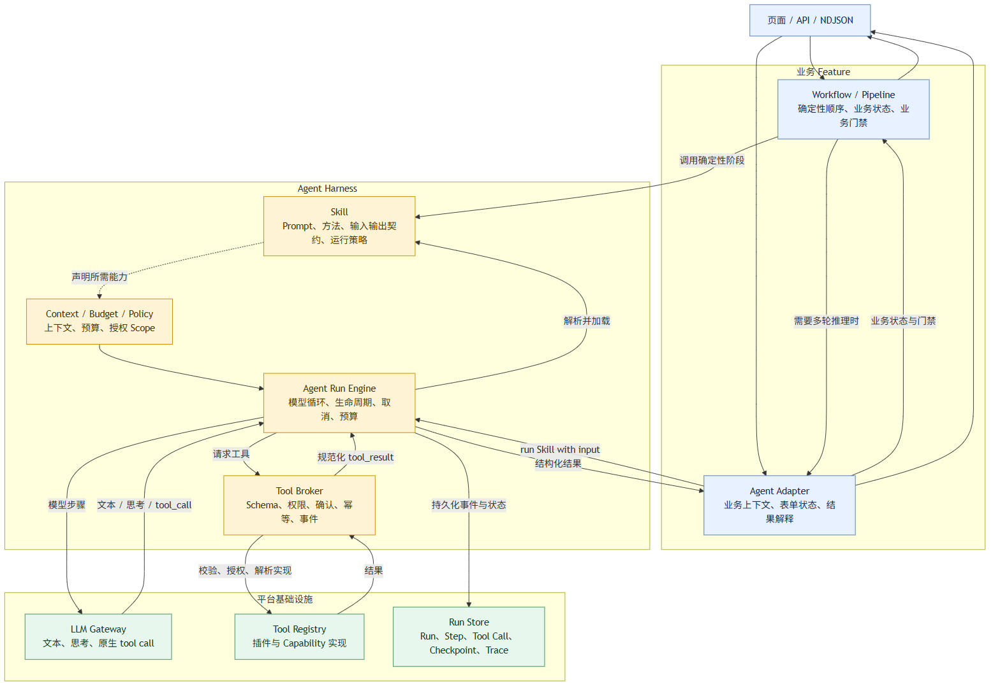
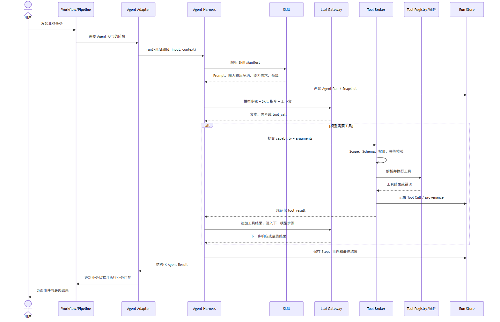
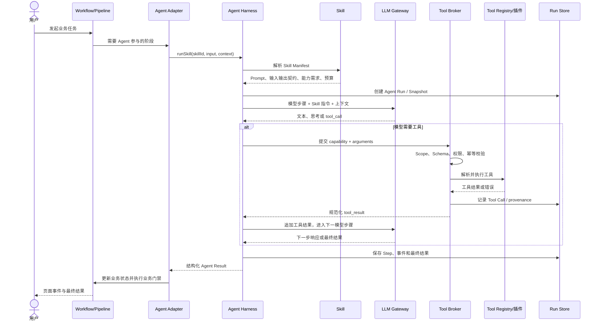

# Agent Harness 对象关系图

## 分层架构



```mermaid
flowchart TB
    UI[页面 / API / NDJSON]

    subgraph FEATURE[业务 Feature]
        WF[Workflow / Pipeline<br/>确定性顺序、业务状态、业务门禁]
        AD[Agent Adapter<br/>业务上下文、表单状态、结果解释]
    end

    subgraph HARNESS[Agent Harness]
        RUN[Agent Run Engine<br/>模型循环、生命周期、取消、预算]
        SK[Skill<br/>Prompt、方法、输入输出契约、运行策略]
        CTX[Context / Budget / Policy<br/>上下文、预算、授权 Scope]
        BROKER[Tool Broker<br/>Schema、权限、确认、幂等、事件]
    end

    subgraph INFRA[平台基础设施]
        LLM[LLM Gateway<br/>文本、思考、原生 tool call]
        REG[Tool Registry<br/>插件与 Capability 实现]
        STORE[Run Store<br/>Run、Step、Tool Call、Checkpoint、Trace]
    end

    UI --> WF
    UI --> AD
    WF -->|调用确定性阶段| SK
    WF -->|需要多轮推理时| AD
    AD -->|run(skillId, input)| RUN
    RUN -->|解析并加载| SK
    SK -.->|声明所需能力| CTX
    CTX --> RUN
    RUN -->|模型步骤| LLM
    LLM -->|文本 / 思考 / tool_call| RUN
    RUN -->|请求工具| BROKER
    BROKER -->|校验、授权、解析实现| REG
    REG -->|结果| BROKER
    BROKER -->|规范化 tool_result| RUN
    RUN -->|持久化事件与状态| STORE
    RUN -->|结构化结果| AD
    AD -->|业务状态与门禁| WF
    WF --> UI
    AD --> UI

    classDef feature fill:#e8f1ff,stroke:#4f7cac,color:#172b4d;
    classDef harness fill:#fff3d6,stroke:#c58a00,color:#4a3500;
    classDef infra fill:#e8f7ed,stroke:#3c8d5a,color:#173b24;
    class UI,WF,AD feature;
    class RUN,SK,CTX,BROKER harness;
    class LLM,REG,STORE infra;
```

## 一次 Agent 运行时序





## 对象关系说明

```text
Workflow / Pipeline
  决定“先做什么、后做什么”，拥有业务流程控制权

Agent
  决定“这一轮如何推理”，拥有模型循环和运行生命周期

Skill
  规定“应该采用什么方法和约束”，不直接执行外部动作

Tool
  执行“读取、搜索、写入、上传、渲染”等具体动作
```

基本调用关系：

```text
Workflow 可以调用 Agent
Workflow 可以直接调用 stage-skill
Agent 必须通过 Skill 获得运行指令
Agent 通过 Tool Broker 调用 Tool
Tool 不负责决定业务流程
Skill 不等于 Tool
```

### 当前项目对应关系

| 概念 | 当前实现 |
|---|---|
| Workflow / Pipeline | `article-pipeline`、`social-card-pipeline`、`research-pipeline`、batch pipeline |
| Agent | `runConversationAgent`、AI visual document agent |
| Skill | `skill-runtime`、`entry-routing`、`skills/*/SKILL.md` 和 Manifest |
| Tool Broker | `tool-catalog`、`tool-executor`、计划中的 Harness Facade |
| Tool Registry | `server/platform/tools/registry.mjs` |
| Run Store | Agent Run、Tool Call、AI Run、generation snapshot 和 SQLite 审计 |

### 关键边界

1. Workflow 不应该把每个阶段都交给 Agent 自由决定。
2. Agent 不应该直接操作插件实现，所有工具调用都应经过 Broker。
3. Skill 可以声明需要哪些工具，但不能绕过运行时授权。
4. Tool 只返回结构化结果，不应该修改业务事实或替换业务门禁。
5. 业务 Feature 负责解释 Agent 结果，Harness 不负责文章或图文领域判断。
