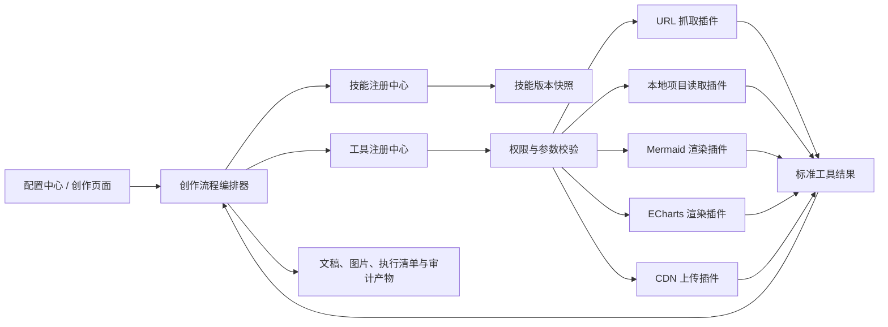

# 工具插件化与创作技能可配置化方案

> 状态：设计完成，待实施  
> 版本：v1.0  
> 日期：2026-07-28  
> 涉及范围：URL 抓取、本地项目读取、Mermaid/ECharts 渲染、图片上传、创作技能、质量门禁、配置中心

## 1. 背景

当前工作台已经具备以下能力：

- 抓取网页、RSS、GitHub 仓库和用户提供的 URL。
- 读取用户明确提供的本地项目目录。
- 将 Mermaid 与 ECharts 围栏渲染为 PNG。
- 将本地图片上传 CDN 并替换文章引用。
- 按文章类型加载不同写作技能、审稿技能和排版技能。

这些能力目前主要以业务模块、脚本和技能目录的形式存在，调用方式不完全统一。文章管线、图文管线和编辑器路由仍然知道部分具体实现，例如脚本路径、渲染器名称、抓取服务和输出文件名。

创作技能也存在三类配置来源：

1. `skills/*/SKILL.md` 中的自然语言契约。
2. 管线代码中写死的阶段、字数、工具和质量门禁。
3. 配置文件中的模型、并发量与输出上限。

当需要更换抓取器、调整写作门禁或增加新文章类型时，通常需要同时修改技能文件、管线代码、路由和页面。目标是将“能力执行”“流程编排”“创作规则”分离。

## 2. 目标

### 2.1 工具插件化

将以下确定性能力注册为可发现、可检查、可授权、可替换的工具插件：

- URL 抓取。
- 本地目录与文件读取。
- Mermaid 渲染。
- ECharts 渲染。
- 图片 CDN 上传。

业务流程只声明需要什么能力，不直接依赖具体实现。

### 2.2 创作技能可配置化

允许在不修改程序代码的情况下调整：

- 技能启用状态。
- 适用内容类型。
- 默认模型。
- 可调用工具。
- Prompt。
- 字数范围。
- 事实、来源、第一人称和质量门禁。
- 自动返工策略。

### 2.3 可追溯与可回滚

每次生成任务冻结当时使用的：

- 技能 ID 与版本。
- Prompt 哈希。
- 工具插件版本。
- 门禁配置。
- 模型配置快照。

后续修改技能不能改变历史批次的审计结果。

## 3. 非目标

第一阶段不包含：

- 用户上传并执行任意 JavaScript、Python 或 Shell 插件。
- 在线插件市场。
- 不经授权读取任意本地目录。
- 让模型绕过工具注册中心直接执行系统命令。
- 将所有业务管线改造成通用无代码工作流。
- 允许关闭事实边界、来源审计等系统级安全门禁。

## 4. 目标架构



核心边界：

- 工具插件回答“如何执行一种能力”。
- 创作技能回答“这类内容应如何写、允许用什么能力”。
- 流程编排器回答“按什么顺序执行、失败后如何恢复”。
- 质量门禁回答“输出能否进入下一阶段”。

## 5. 工具插件设计

### 5.1 插件目录

建议新增：

```text
plugins/
  url-fetch/
    manifest.json
    adapter.mjs
  local-project-reader/
    manifest.json
    adapter.mjs
  mermaid-render/
    manifest.json
    adapter.mjs
  echarts-render/
    manifest.json
    adapter.mjs
  upyun-image-upload/
    manifest.json
    adapter.mjs
```

第一阶段只加载项目内白名单目录，不扫描用户任意路径。

### 5.2 Manifest

```json
{
  "id": "mermaid-render",
  "name": "Mermaid 图片渲染",
  "version": "1.0.0",
  "capabilities": ["diagram.mermaid.render"],
  "entry": "./adapter.mjs",
  "riskLevel": "local-write",
  "inputSchema": {},
  "outputSchema": {},
  "healthCheck": true,
  "enabledByDefault": true
}
```

必要字段：

| 字段 | 含义 |
| --- | --- |
| `id` | 稳定插件标识 |
| `version` | 插件实现版本 |
| `capabilities` | 对外提供的能力 |
| `entry` | 受控执行入口 |
| `riskLevel` | 只读、本地写入、外部写入 |
| `inputSchema` | 参数校验 |
| `outputSchema` | 标准结果校验 |
| `healthCheck` | 是否支持环境检查 |

### 5.3 执行协议

```js
export async function execute(input, context) {
  return {
    status: "ok",
    data: {},
    artifacts: [],
    provenance: {},
    warnings: [],
    metrics: { durationMs: 0 }
  };
}
```

`context` 只能由注册中心创建，包含：

- 当前批次、候选和任务 ID。
- 允许访问的目录根。
- 临时目录。
- 日志记录器。
- 超时和文件大小限制。
- 授权状态。
- 非敏感运行配置。

插件不能自行读取数据库、模型密钥或任意环境变量。

### 5.4 标准错误

```json
{
  "status": "error",
  "error": {
    "code": "DEPENDENCY_MISSING",
    "message": "未检测到 Mermaid CLI",
    "retryable": false,
    "action": "运行环境检测或安装可选依赖"
  }
}
```

建议统一错误码：

- `INVALID_INPUT`
- `PERMISSION_DENIED`
- `PATH_OUTSIDE_ALLOWED_ROOTS`
- `DEPENDENCY_MISSING`
- `FETCH_FAILED`
- `RENDER_FAILED`
- `UPLOAD_FAILED`
- `TIMEOUT`
- `OUTPUT_INVALID`

### 5.5 各插件边界

#### URL 抓取

输入 URL、抓取策略和最大正文长度；输出正文、标题、最终 URL、抓取方法、时间和 provenance。内部可以按配置选择直连、Firecrawl、RSSHub 或专用适配器。

#### 本地项目读取

只接受用户本轮明确提供或已授权的绝对路径。执行扩展名白名单、目录根检查、文件数与字符上限，不读取密钥、构建产物和依赖目录。

#### Mermaid/ECharts

输入代码、主题 tokens、尺寸与输出目录。只返回 PNG 和复杂度报告。ECharts 第一阶段继续只接受严格 JSON，不执行任意 JavaScript。

#### CDN 上传

属于外部写入插件。必须接收已存在的本地图片和明确授权上下文，返回 HTTPS URL、对象键和校验信息。

## 6. 工具注册中心

建议新增：

```text
lib/tools/
  registry.mjs
  manifest-loader.mjs
  policy.mjs
  schemas.mjs
  execution-log.mjs
```

核心接口：

```js
registry.listCapabilities()
registry.health(capability)
registry.resolve(capability, preferences)
registry.execute(capability, input, context)
```

同一能力可以存在多个实现，例如：

```text
content.url.fetch
  ├─ builtin-direct-fetch
  ├─ firecrawl-fetch
  └─ rsshub-fetch
```

注册中心根据启用状态、健康检查和优先级选择实现。业务代码只调用 `content.url.fetch`。

## 7. 创作技能配置模型

### 7.1 技能包

```text
writing-skills/
  wechat-tech-tutorial/
    manifest.json
    prompt.md
    gates.json
    defaults.json
```

保留现有 `SKILL.md` 作为人类可读说明和兼容入口，运行时逐步迁移到结构化文件。

### 7.2 技能 Manifest

```json
{
  "id": "wechat-tech-tutorial",
  "name": "技术使用教程",
  "version": "1.0.0",
  "articleTypes": ["independent"],
  "inputContract": "tutorial_fact_base",
  "outputContract": "wechat_markdown",
  "allowedTools": [
    "content.url.fetch",
    "filesystem.project.read",
    "diagram.mermaid.render"
  ],
  "stages": [
    "draft",
    "humanize",
    "review",
    "final-gate",
    "image-plan"
  ]
}
```

### 7.3 门禁配置

```json
{
  "length": {
    "minVisibleChars": 1200,
    "maxVisibleChars": 2200
  },
  "facts": {
    "unverifiedClaims": "error",
    "missingAttribution": "error",
    "modelSuggestionAsExperience": "error"
  },
  "voice": {
    "firstPerson": "allow_with_author_source",
    "personalTestClaim": "require_author_experience"
  },
  "repair": {
    "enabled": true,
    "maxAttempts": 1
  }
}
```

门禁等级：

- `error`：阻断。
- `warning`：允许继续但必须展示。
- `off`：只允许关闭非系统安全规则。

系统级硬门禁不能通过技能配置关闭，例如：

- 未授权本地目录访问。
- 未授权外部上传。
- 路径越界。
- 执行任意代码。
- 明确伪造来源或作者亲历。

### 7.4 可编辑范围

第一阶段允许编辑：

- Prompt 正文。
- 默认模型。
- 字数范围。
- 工具白名单。
- 可配置门禁等级。
- 自动返工次数。

第一阶段不允许编辑：

- 管线 JavaScript。
- 文件系统权限规则。
- 外部上传授权规则。
- 输入输出 Schema 的系统保留字段。

## 8. 技能版本与快照

新增数据概念：

```text
skill_definitions
skill_versions
tool_plugins
tool_executions
generation_snapshots
```

每次任务启动时生成快照：

```json
{
  "skillId": "wechat-tech-tutorial",
  "skillVersion": "1.2.0",
  "promptHash": "sha256:...",
  "gateHash": "sha256:...",
  "tools": [
    { "capability": "filesystem.project.read", "plugin": "local-project-reader", "version": "1.0.0" }
  ],
  "modelProvider": "custom-openai",
  "model": "example-model"
}
```

历史任务重试默认使用原快照；用户明确选择“使用最新技能重新执行”时才升级版本。

## 9. 配置中心设计

建议在“运行与配置”中增加：

### 工具能力

- 能力名称与状态。
- 当前实现与版本。
- 依赖检查。
- 权限等级。
- 默认优先级。
- 测试按钮。
- 最近错误。

### 创作技能

- 技能列表与启用状态。
- 适用文章类型。
- 默认模型。
- Prompt 编辑。
- 工具授权。
- 字数与门禁配置。
- 保存为新版本。
- 版本对比与恢复。
- 使用测试事实基座试运行。

“模型中心”仍然只展示已配置模型，不承载技能或工具设置。

## 10. 迁移策略

采用兼容适配器，避免一次性重写所有管线。

### 阶段 A：工具注册中心 MVP

1. 建立 manifest loader、registry、policy 和标准结果。
2. 将现有实现包装成插件 adapter。
3. 原有函数继续保留，内部改为调用注册中心。
4. 不改变页面和数据库主流程。

优先迁移：

1. 本地项目读取。
2. Mermaid 渲染。
3. ECharts 渲染。

这些能力边界清晰，失败影响范围可控。

### 阶段 B：URL 抓取与 CDN

1. 将 URL 抓取策略统一到 `content.url.fetch`。
2. 保留现有来源审计与缓存结构。
3. 将 CDN 上传统一到 `image.cdn.upload`。
4. 增加外部写入授权记录。

### 阶段 C：技能注册中心只读化

1. 扫描现有技能并展示实际生效版本。
2. 生成技能清单和 Prompt 哈希。
3. 管线记录 generation snapshot。
4. 暂不开放编辑。

### 阶段 D：受控配置编辑

1. 开放 Prompt、模型、字数和工具白名单。
2. 开放可配置质量门禁。
3. 每次保存生成新版本，不覆盖历史版本。
4. 增加差异查看、恢复和试运行。

### 阶段 E：迁移全部创作流程

按顺序迁移：

1. 自主写作。
2. 批次早报。
3. 热点事件文章。
4. 工具图文。
5. 自定义图文。
6. 事件图文。
7. 公众号排版。

## 11. 工作量评估

| 阶段 | 内容 | 预计工作量 |
| --- | --- | ---: |
| A | 注册中心、本地读取、Mermaid、ECharts | 4–6 人日 |
| B | URL 抓取、CDN、权限审计 | 3–5 人日 |
| C | 技能发现、快照、只读技能中心 | 3–4 人日 |
| D | 技能编辑、版本、门禁配置、试运行 | 4–6 人日 |
| E | 六类创作与排版流程迁移 | 4–7 人日 |
| 合计 | 完整方案 | 18–28 人日 |

可用 MVP：

- 工具注册中心。
- 三个低风险本地插件。
- 只读技能中心。
- Prompt、字数和工具白名单配置。

预计 7–10 人日。

## 12. 风险与控制

### 权限扩大

风险：模型借工具读取任意目录或执行任意代码。  
控制：绝对路径授权、根目录白名单、扩展名限制、工具能力白名单、禁止 Shell 插件。

### 历史任务漂移

风险：修改技能后，旧批次重新执行得到不可解释的不同结果。  
控制：任务冻结技能和工具版本，重试默认复用原快照。

### 门禁互相矛盾

风险：Prompt 允许第一人称，门禁禁止第一人称。  
控制：保存技能版本前执行静态契约检查，发现冲突时禁止发布。

### 插件结果不一致

风险：更换抓取器或渲染器后输出结构变化。  
控制：输入输出 JSON Schema、契约测试、标准错误码和 provenance。

### 配置误操作

风险：用户修改 Prompt 导致生产任务大面积失败。  
控制：草稿版本、试运行、显式发布、快速回滚和内置版本保护。

## 13. 验收标准

### 工具插件

- 业务管线不直接引用 Mermaid/ECharts 脚本路径。
- 本地读取只能访问已授权目录。
- URL 抓取结果保留来源与抓取方法。
- ECharts 不执行任意 JavaScript。
- CDN 上传有明确外部写入记录。
- 插件缺少依赖时返回可操作错误。

### 创作技能

- 配置修改生成新版本。
- 每个任务保存完整技能快照。
- 历史任务可按原版本重试。
- Prompt 与门禁冲突可在发布前发现。
- 禁用工具后，技能不能隐式调用该能力。
- 内置技能可恢复且不可被永久删除。

### 兼容性

- 现有三类文章和三类图文入口保持不变。
- 现有批次、候选、文稿与产物可以继续查看。
- 未配置插件时使用内置兼容适配器。
- 插件化前后的标准输入在契约测试中得到等价结果。

## 14. 推荐开工顺序

1. 先实现 Tool Registry 与权限策略。
2. 包装本地项目读取插件。
3. 包装 Mermaid 和 ECharts 插件。
4. 在配置中心增加只读“工具能力”页。
5. 迁移 URL 抓取和 CDN。
6. 建立 Skill Registry 与任务快照。
7. 增加只读“创作技能”页。
8. 开放受控配置和版本发布。
9. 从自主写作开始逐条迁移创作管线。

开始实施前，应先为现有工具和技能补齐契约测试，以其输出作为迁移基线。
